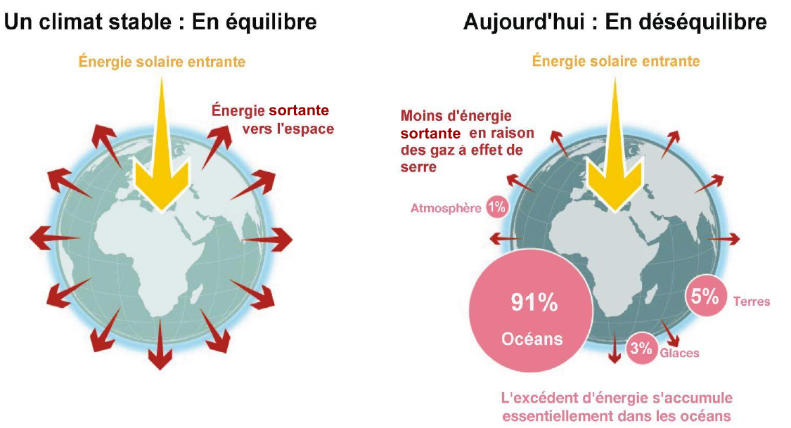
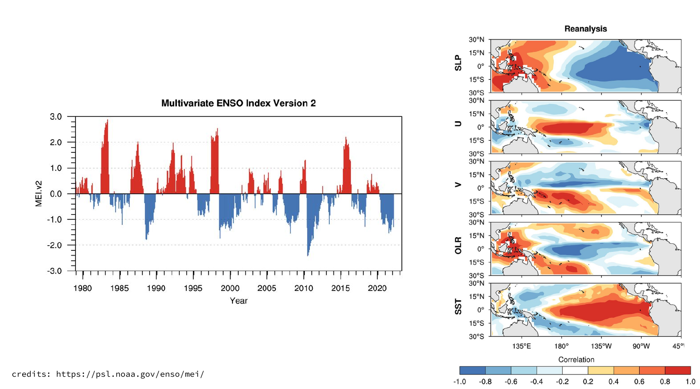
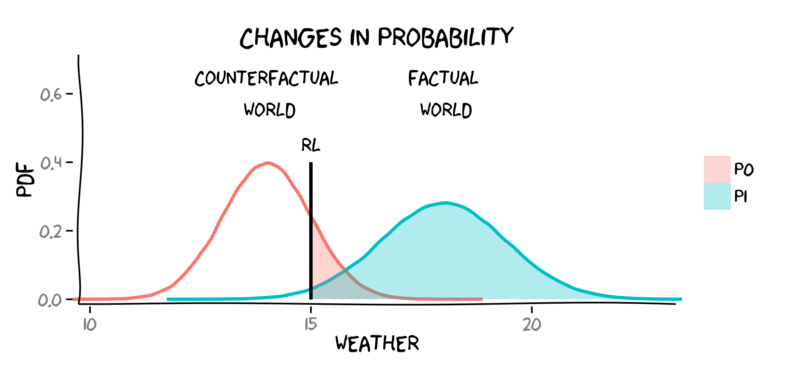

---

title: "Overview"
subtitle: "Statistique pour l'étude du climat"
institute: "LSCE, ESTIMR"
date: "2020/10/01 (updated: `r Sys.Date()`)"
output:
  xaringan::moon_reader:
    lib_dir: libs
    nature:
      highlightStyle: github
      highlightLines: true
      countIncrementalSlides: false
  
---
# Disclaimer

Je ne suis pas physicien, ni climatologue. Le cours reflète simplement ce que j'ai appris en tant que "statisticien" sur l'analyse de données climatiques. Vous en savez donc sûrement plus que moi sur le climat.

Le cours n'est pas exhaustif et ne fait que survoler certains aspects. L'objectif est de vous familiariser avec certaines notions importantes et de vous orienter vers des ressources complémentaires pour vous renseigner davantage de votre côté.

Une grande partie est notamment inspirée des cours de [Julien Cattiaux](https://www.umr-cnrm.fr/spip.php?article629). Je vous invite grandement à les consulter.

Bien sûr, l'objectif de ce cours est aussi d'en discuter ensemble.

C'est la première année que se tient ce cours (et dans un contexte un peu particulier...). Toutes les remarques dans le but de l'améliorer sont les bienvenues. En particulier, ne pas hésiter à poser des questions. 

---
# Plan du jour

- Etude du climat: pourquoi les statistisques ?

- Focus sur deux domaines de la climatologie statistique:
  - La correction de biais
  - La détection et attribution du changement climatique

- TP si le temps le permets


---
# Climat ou météo ? 

### Comment s'habiller demain ? 


---
# Climat ou météo ? 

### Comment construire sa maison ? 


---
# Le sytème climatique


# Le climat


En un lieu et un instant donnés,c’est ensemble des conditions météorologiques possibles.
L’ensemble des conditions météorologique possible résulte de l'interaction entre les
composantes du système climatique.

---
# définition de l'IPCC


**Climate:**

> Climate in a narrow sense is usually defined as the <font color="blue">*average weather*</font>, or more rigorously, as  <font color="blue">*the statistical description*</font> in terms of the  <font color="blue">*mean*</font> and  <font color="blue">*variability*</font> of relevant quantities over a period of time ranging from months to thousands or millions of years. 

> The classical period for  <font color="blue">*averaging*</font> these variables is 30 years, as defined by the World Meteorological Organization.

> The relevant quantities are most often surface variables such as temperature, precipitation and wind. 

> Climate in a wider sense is the state, including a  <font color="blue">*statistical description*</font>, of the climate system

[IPCC, 2013: Annex III: Glossary](https://www.ipcc.ch/site/assets/uploads/2018/02/WG1AR5_AnnexIII_FINAL.pdf)

---
# Climat et météo pour un statisticien


***Le climat est comme une distribution de probabilité et la météo  ses réalisations.***

---
# Systèmes chaotiques

**Chaotic:**

> A dynamical system such as the climate system, governed by nonlinear deterministic equations, may exhibit erratic or chaotic behaviour 

> very small changes in the initial state of the system in time lead to large and apparently unpredictable changes in its temporal evolution. 

> Such chaotic behaviour limits the predictability of the state of a nonlinear dynamical system at specific future times, 

> although changes in its statistics may still be predictable given changes in the system parameters or boundary conditions

[IPCC, 2013: Annex III: Glossary](https://www.ipcc.ch/site/assets/uploads/2018/02/WG1AR5_AnnexIII_FINAL.pdf)


---
# Exemple: le système de Lorenz

<p align="center">

<br/>
<a href="https://en.wikipedia.org/wiki/Image:TwoLorenzOrbits.jpg">from en.wikipedi.org</a>
</p>


---
# Exemple: prévision métérologique

<p align="center">

<br/>
<a href="https://en.wikipedia.org/wiki/Image:TwoLorenzOrbits.jpg">from en.wikipedi.org</a>
</p>

---
# Systèmes déterministes et aléas

Lorsque l'on simule l'évolution du climat au 20ème siècle, on ne connaît pas assez précisément les conditions initiales de l'ère pré-industrielle. 

Par exemple, la trajectoire de la température moyenne globale ne peut donc être exactement reproduite. 


<p align="center">

<br/>
<a href="(https://www.ipcc.ch/site/assets/uploads/2018/02/WG1AR5_Chapter10_FINAL.pdf">IPCC AR5, Fig. 10.1</a>
</p>

---
# Systèmes déterministes et aléas

<p align="center">

<br/>
<a href="https://journals.ametsoc.org/view/journals/bams/96/8/bams-d-13-00255.1.xml">credits: Kay et al., “The Community Earth System Model (CESM) Large Ensemble Project: A Community Resource for Studying Climate Change in
the Presence of Internal Climate Variability.”
</a>
</p>
---

# Modélisation statistique


En modélisation statistique, la partie du signal que l’on pense être capable de prédire est souvent supposée déterministe.  Le reste est modélisé comme du bruit, i.e. par une variable aléatoire.

<br/>
Exemple: étude de tendance par régression linéaire: 

$$Y = a X + b + \epsilon$$
avec par exemple 

- $X$, le temps
- $Y$, la température
- $\epsilon$, du bruit


<!-- Pour comprendre ce qui peut être modélisé comme un signal déterministe ou comme du bruit, il faut connaître les différentes sources de variabilité climatique. -->

.footnote[Pour l'analyse de tendance, voir aussi [IPCC AR5, Chapter 2, Box 2.2, p 179](https://www.ipcc.ch/site/assets/uploads/2017/09/WG1AR5_Chapter02_FINAL.pdf
)]
---
# Décomposition de la variabilité climatique
 <br/>
<ul>
  <li style="list-style-type: none;">Climat = état moyen + variabilité climatique.</li> 
  <br/> <br/>
  <li style="list-style-type: none;">Variabilité climatique = variabilité interne + forçages externes.</li> 
  <br/> <br/>
  <li style="list-style-type: none;">Forçages externes = forçages naturels + forçages anthropiques.</li> 
  <br/> <br/>
  <li style="list-style-type: none;">Variabilité interne + forçages naturels = variabilité naturelle.</li> 
  <br/> <br/>
</ul>
 <br/>


.footnote[repris de Cattiaux, Système Climatique IENM, [notes](https://www.umr-cnrm.fr/IMG/pdf/cattiaux_climat_notes_de_cours-2.pdf
) et  [cours 3/10](https://www.umr-cnrm.fr/IMG/pdf/cattiaux_ienm_climat_03_print.pdf) (1A)]
---

# Modélisation statisque


<br/>
 
$$\underbrace{\text{Climat}}_{aléatoire} = \underbrace{\text{état moyen} +  \text{forçages externes}}_{déterministe} + \underbrace{\text{variabilité interne}}_{aléatoire}$$
 <br/>
 <dl>
  <dt>**réponse du climat aux forcages externes**</dt>
  <dd>- considérée comme déterministe </dd>
  <dd>- gouvernée par de grands équilibres physiques (bilan d'énergie)</dd>
  <br/><br/>
  <dt>**variabilité interne**</dt>
  <dd>- ce qui modifie la répartition de l'énergie à l'intérieur du système à l'équilibre</dd>
  <dd>- difficile à prévoir de par son charactère chaotique</dd>
  <dd>- considérée comme aléatoire</dd>
</dl>

---


# Différentes échelles temporelles

<br/>

<p align="center">

<br/>
<a href="https://www.umr-cnrm.fr/IMG/pdf/cattiaux_ienm_climat_03_print.pdf">de Cattiaux, Système Climatique IENM 3/10 (1A)</a>
</p>


<br/>


Par exemple, on peut modéliser des données horaires par:
$$
\begin{aligned}
\text{Climat} =  &\text{moyenne } +  \\
&\color{green}{\text{tendance}} +  \color{green}{\text{cycle saisonnier moyen}} +  \color{green}{\text{cycle diurne moyen }} + \\
&\color{blue}{\text{bruit}}
\end{aligned}
$$

---
# Différentes échelles temporelles
<p align="center">

<br/>
<a href="https://www.umr-cnrm.fr/IMG/pdf/cattiaux_ienm_climat_03_print.pdf">de Cattiaux, Système Climatique IENM 3/10 (1A)</a>
</p>

---
# Bilan d'énergie
<p align="center">

<br/>
<a href="">source:IPCC AR6 & @YannWeb </a>
</p>


---
# Bilan radiatif
<p align="center">

<br/>
<a href="">source:IPCC AR6 & @YannWeb </a>
</p>

---
# Forçages radiatifs

> Le terme de forçage climatique (ou forçage radiatif) désigne une perturbation d’origine extérieure au système climatique qui impacte son bilan radiatif. 


<a href="https://www.climat-en-questions.fr/reponse/fonctionnement-climat/forcage-climatique-par-david-saint-martin-olivier-boucher">climat-en-questions.fr </a>

---
# Forçages radiatifs


<p align="center">

<br/>
<a href="">source:IPCC AR6 & @YannWeb </a>
</p>

---
# Modéliser le bruit

<br/>
- **Distribution**, e.g. gaussienne, uniforme...

<br/>
- **Dependance temporelle** (e.g. autocorrélation)

  - sans dépendance, e.g. [bruit blanc](https://en.wikipedia.org/wiki/White_noise#White_noise_vector)
  
  - avec dépendance, e.g. [processus autorégressif](https://en.wikipedia.org/wiki/Autoregressive_model), [processus moving-average](https://en.wikipedia.org/wiki/Moving-average_model)

<br/>
- **Stationnaire**: Les propriétés statistiques du bruit évoluent-elles dans le temps ?

---
# Dépendance temporelle
```{r, echo=FALSE, fig.height=5, dev='svg'}
n <- 500
par(mar = c(4, 4, 1, .1))
layout(matrix(c(1,1,2,3,4,5), 3, 2, byrow = TRUE))
ylim <- c(-3, 3)
X <- rnorm(2*n, 0, 1)
plot(X, xlab = "", type = "l", ylim = ylim, main = "i.i.d. gaussian")

ar1 <- 0.5
X <- arima.sim(list(order=c(1,0,0), ar=ar1), n=n)*sqrt(1-ar1^2)
plot(X, xlab = "", ylim = ylim, main = expression(paste("AR(1), ", phi, "=0.5")))


ar1 <- 0.9
X <- arima.sim(list(order=c(1,0,0), ar=ar1), n=n)*sqrt(1-ar1^2)
plot(X, xlab = "", ylim = ylim, main = expression(paste("AR(1), ", phi, "=0.9")))


ar1 <- 0.5
X <- arima.sim(list(order=c(0,0,1), ma=ar1), n=n)/sqrt(1+ar1^2)
plot(X, xlab = "", ylim = ylim, main = expression(paste("MA(1), ", theta, "=0.5")))


ar1 <- 0.9
X <- arima.sim(list(order=c(0,0,1), ma=ar1), n=n)/sqrt(1+ar1^2)
plot(X, xlab = "", ylim = ylim, main = expression(paste("MA(1), ", theta, "=0.9")))
``` 

---
# Fonction d'autocorrélation
```{r, echo=FALSE, fig.height=5, dev='svg'}
n <- 500
par(mar = c(4, 4, 1, .1))
layout(matrix(c(1,1,2,3,4,5), 3, 2, byrow = TRUE))
X <- rnorm(2*n, 0, 1)
plot(acf(X, plot = FALSE), main = "i.i.d. gaussian")

ar1 <- 0.5
X <- arima.sim(list(order=c(1,0,0), ar=ar1), n=n)*sqrt(1-ar1^2)
plot(acf(X, plot = FALSE), main = expression(paste("AR(1), ", phi, "=0.5")))


ar1 <- 0.9
X <- arima.sim(list(order=c(1,0,0), ar=ar1), n=n)*sqrt(1-ar1^2)
plot(acf(X, plot = FALSE),  main = expression(paste("AR(1), ", phi, "=0.9")))


ar1 <- 0.5
X <- arima.sim(list(order=c(0,0,1), ma=ar1), n=n)/sqrt(1+ar1^2)
plot(acf(X, plot = FALSE), main = expression(paste("MA(1), ", theta, "=0.5")))


ar1 <- 0.9
X <- arima.sim(list(order=c(0,0,1), ma=ar1), n=n)/sqrt(1+ar1^2)
plot(acf(X, plot = FALSE), main = expression(paste("MA(1), ", theta, "=0.9")))
``` 

---
# Stationarité ?
```{r, echo=FALSE, fig.height=5, dev='svg'}
n <- 1000
par(mar = c(4, 4, 1, .1))
par(mfrow = c(3, 1))
ylim <- c(-4, 4)

X <- rnorm(n, 0 + seq(0, 1, length.out = n), 1)
plot(X, xlab = "", type = "l", ylim = ylim, main = "non-stationnarité en moyenne")

X <- rnorm(n, 0, 1 + seq(0, 1, length.out = n))
plot(X, xlab = "", type = "l", ylim = ylim, main = "non-stationnarité en variance")

ar1 <- seq(0.3, 1, length.out = n)
for(i in 2:n){
  X[i] <-  (ar1[i] * X[i-1]  + rnorm(1)) / sqrt(1 + ar1[i]^2)
}
plot(X, xlab = "", , type = "l", ylim = ylim, main = "non-stationnarité en dependance temporelle")
``` 

---
# Le climat est un sytème à très grandes dimensions

Processus spatial et temporelle multivariées et à grande dimension.

Comment l'appréhendez, le décrire, le visualizez ?

Quelles sont les principaux "mode de variabilité" ? quelles sont les différentes échelles de temps et d'espaces

---
# Differentes échelles spatio-temporelles
<p align="center">

<br/>
<a href="https://public.wmo.int/en/about-us/vision-and-mission/wmo-integrated-global-observing-system">Source WMO</a>
</p>


--- 
# Mode de variabilité

> Structure spatio temporelle sous
jacente privilégiant une configuration spatiale et une variation temporelle, qui
contribue à la prise en compte des grandes caractéristiques de la variance et
des téléconnexions. On considère souvent qu’un mode de variabilité constitue
le produit d’une configuration spatiale du climat et d’une série chronologique
d’un indice climatique associé.

--- 
# Téléconnexion

> Téléconnexion Association statistique de variables climatiques entre des
zones géographiques fixes, éloignées les unes des autres. Les téléconnexions
découlent de vastes structures spatiales, notamment les modes couplés, à
l’échelle d’un bassin, de la variabilité océan-atmosphère, les trains d’ondes de
Rossby, les courants-jets et les rails des dépressions des latitudes moyennes,
etc.

---
# ENSO

<p align="center">

<br/>
<a href="https://psl.noaa.gov/enso/mei/
">Source NOAA</a>
</p>

---
# Indice ENSO défini par ACP

<p align="center">

</p>

---
# ENSO et teleconnexions

<p align="center">

<br/>
</p>

---
# En résumé

La modélisation statistique du climat est une approximation du système climatique.

A quel point cette approximation doit être fidèle à la réalité?

Selon l'application, choisir ce que l'on considère comme un signal déterministe ou comme du bruit:

- Quel modèle pour la partie déterministe ?

- Quel modèle pour le bruit ?

A partir de quels jeux de données ?

---
# Les données et leurs incertitudes.

Les observations

Les simulations climatiques

Les réanalyses

---
# Les observations

<p align="center">

<br/>
<a href="https://public.wmo.int/en/about-us/vision-and-mission/wmo-integrated-global-observing-system">Source WMO</a>
</p>


---
# Incertitudes dans les mesures

<br/>


> The uncertainty in observational records encompasses

>  - instrumental/recording errors.

> - effects of representation (e.g., exposure, observing frequency or timing).

> - effects due to physical changes in the instrumentation (such as station relocations or new satellites).


[IPCC AR5, Box 2.1](https://www.ipcc.ch/site/assets/uploads/2017/09/WG1AR5_Chapter02_FINAL.pdf
)
---
# Erreurs instrumentales:  altimétrie

<p align="center">

<br/>
<a href="http://www.altimetry.info/radar-altimetry-tutorial/data-flow/data-processing/geophysical-corrections/">Source: altimetry.info</a>
</p>


---
# Erreurs instrumentales:  altimétrie


**Error budget of Envisat Altimetry Mission**

Envisat Altimetry | Specified | Observed | Comments 
------------ | :------------- | :----------- | :----------- 
 Altimeter noise | 4.5cm | 2cm | Altimeter noise computed on post launch data
 Sea State Bias | 2cm | 0.5cm | SSB error estimated from differences between different empirical models. Value at 2m SWH. 
 Ionosphere  | 0.2cm  | 0.7cm |Derived from cross-sensor comparisons
 Dry troposphere | 0.7cm | 0.7cm | From uncertainties in ECMWF atmospheric fields used to derive the correction. Value at 2-3 hPa sea level pression. 
 Wet troposphere | 1.4cm | 1.5cm | Comparisons with ECMWF correction.
 Radial Orbit error| 2cm | 1.7cm | From POD operational monitoring

[Source: CLS](https://earth.esa.int/documents/700255/3528455/Error_Budget_Envisat_Altimetry_Mission.pdf)

---

# Erreurs instrumentales:  pluviomètre 


<p align="center">

<strong>Effet Venturi</strong>
<br/>

</p>

> les pertes attribuées au vent sont de l’ordre de 2 à 15% dans le cas de la pluie, 

> et pouvant atteindre 80% pour la neige (Sevrük, 1996). 

[Thèse Olivier Mestre (2010)](http://hydrologie.org/THE/MESTRE.pdf)

---

# Echantillonage

<p align="center">

<strong>Orbit de SWOT</strong>
<br/>


<a href=https://swot.jpl.nasa.gov/resources/89/swot-science-orbit/">C. Ubelmann, CLS (left, center) and JPL/NASA (right)</a>

</p>

---

# Echantillonage

<p align="center">
<strong>Station coverage for the CRU TS dataset </strong>
<br/>


<br/>

<a href="https://doi.org/10.1038/s41597-020-0453-3">Harris et al. (2020)</a>
</p>

---


# Homogénéité des séries climatologiques
<br/>

> Les séries climatologiques instrumentales sont le résultat de la superposition de deux signaux bien distincts : 

> − L’évolution climatique que l’on cherche à étudier.

> − Les ruptures dues à la modification des conditions de mesure. 

> Malheureusement, ces ruptures artificielles peuvent être du même ordre de grandeur que les caractéristiques climatiques que l’on veut mettre en évidence. 

> Les séries brutes sont la plupart du temps complètement faussées par ces anomalies, qu’il va falloir détecter, puis corriger.

[Thèse Olivier Mestre (2010)](http://hydrologie.org/THE/MESTRE.pdf)

---

# Homogénéisation relative

<p align="center">

<br/>
<a href="http://hydrologie.org/THE/MESTRE.pdf">Thèse Olivier Mestre (2010)</a>
</p>


---
# Homogénéisation relative

<p align="center">

<br/>
<a href="http://hydrologie.org/THE/MESTRE.pdf">Thèse Olivier Mestre (2010)</a>
</p>

---
# Homogénéisation : effet sur les tendances 

<p align="center">

<br/>


<br/>
<a href="http://hydrologie.org/THE/MESTRE.pdf">Thèse Olivier Mestre (2010)</a>
<br/>
</p>

---
# Spatialisation des données

<p align="center">

<br/>

<br/>

<br/>
<a href="https://doi.org/10.1038/s41597-020-0453-3">Harris et al. (2020)</a> et 
<a href="https://www.globalclimatemonitor.org">www.globalclimatemonitor.org</a>
<br/>
</p>

---
# Interpolation 

**Exemple: inverse distance weighting**

A general form of finding an interpolated value $u$ at a given point $x$ based on samples $u_i=u(x_i)$ for $i=1,2,...,N$ using IDW is an interpolating function:

$$y(\mathbf{x}) = \begin{cases}
 \dfrac{\sum_{i = 1}^{N}{ w_i(\mathbf{x}) y_i } }{ \sum_{i = 1}^{N}{ w_i(\mathbf{x}) } }, & \text{if } d(\mathbf{x},\mathbf{x}_i) \neq 0 \text{ for all } i, \\
 y_i, & \text{if } d(\mathbf{x},\mathbf{x}_i) = 0 \text{ for some } i,
\end{cases}$$

where
$$w_i(\mathbf{x}) =  \frac{1}{d(\mathbf{x},\mathbf{x}_i)^p}$$

[Source: Wikipedia](https://en.wikipedia.org/wiki/Inverse_distance_weighting)

---
# Exemple synthétique

```{r, echo=FALSE, fig.height=4, dev='svg'}
n <- 5
X <- c(-8, -2, 1, 4, 5, 7, 9)
Y <- X^2
par(mar = c(4, 4, 1, .1))
plot(X, Y, pch = 19, las = 1, xlim = c(-10, 10), ylim = c(-5, 102), cex = 2, main = "IWD interpolation for p = 1")
Xnew <- seq(-10, 10, by = 0.1)
Ynew <- numeric(length(Xnew))
col <- numeric(length(Xnew))
for( i in seq_along(Xnew)){
  dist <- abs(X - Xnew[i])
  weight <- 1/dist
  weight <- weight/sum(weight)
  Ynew[i] <- sum(weight * Y)
}
lines(Xnew, Ynew, col = "orange", lty = 2)
lines(Xnew, Xnew^2, col = "black", lty = 2)
points(Xnew[Xnew == 2], Ynew[Xnew == 2], col = "orange", cex = 2, pch = 19)

segments(2, -10, 2, 110, col = "red4", lty = 2)

text(2, Ynew[Xnew == 2], col = "red4", labels = "Ŷnew", pos = 2)
text(2, -5, col = "red4", labels = "Xnew", pos = 2)

dist <- abs(X - 2)
weight <- 1/dist
weight <- weight/sum(weight)
weight <- weight/max(weight)
Ynew[i] <- sum(weight * Y)
for( i in seq_along(X)){
  arrows(2, Y[i], X[i], Y[i], code = 3, lty = 1, lwd = weight[i], length = 0.1, angle = 25)
}
``` 

---
# Qualité de l'interpolation
<p align="center">
  <strong>Evaluation par leave-one-out <a href="https://en.wikipedia.org/wiki/Cross-validation_(statistics)"> cross-validation </a> </strong>
</p>
```{r, echo=FALSE, fig.height=4, dev='svg'}
n <- 5
X <- c(-8, -2, 1, 4, 5, 7, 9)
Y <- X^2
par(mar = c(4, 4, 1, .1), mfrow = c(2, 2))
for(iloo in c(1, 3, 5, 7)){
  plot(X, Y, pch = 19, las = 1, xlim = c(-10, 10), ylim = c(-5, 102), cex = 2, main = "IWD interpolation for p = 1")
  Xnew <- seq(-10, 10, by = 0.1)
  Ynew <- numeric(length(Xnew))
  col <- numeric(length(Xnew))
  for( i in seq_along(Xnew)){
    dist <- abs(X[-iloo] - Xnew[i])
    weight <- 1/dist
    weight <- weight/sum(weight)
    Ynew[i] <- sum(weight * Y[-iloo])
  }
  lines(Xnew, Ynew, col = "orange", lty = 2)
  lines(Xnew, Xnew^2, col = "black", lty = 2)
  points(X[iloo], Y[iloo], col = "grey", cex = 2, pch = 19)
  points(Xnew[Xnew == X[iloo]], Ynew[Xnew == X[iloo]], col = "orange", cex = 2, pch = 19)
  
  segments(X[iloo], -10, X[iloo], 110, col = "red4", lty = 2)
  
  text(X[iloo], Ynew[Xnew == X[iloo]], col = "red4", labels = "Ŷnew", pos = 2)
  text(X[iloo], -5, col = "red4", labels = "Xnew", pos = 2)
}
``` 
---
# Qualité de l'interpolation

<p align="center">
<strong>Evaluation par <a href="https://en.wikipedia.org/wiki/Cross-validation_(statistics)"> cross-validation </a> </strong>

<br/>

<br/>
<a href="https://doi.org/10.1038/s41597-020-0453-3">Harris et al. (2020)</a> 
<br/>
</p>

---

# Aucun jeu d'observations n'est parfait.

<br/>
Quelle est la précision des mesures et leur biais ?

<br/>
Quelle est l'échantillonnage spatiale et temporel ?

<br/>
Y a-t-il des ruptures dans les séries temporelles ?

<br/>
Comment est évaluée la qualité des données et quels sont les post-traitements appliqués ?


---
# Les simulations climatiques

<p align="center">
<strong> Le système climatique </strong>
<br/> Quelles approximations sommes nous prêts à faire ?

<br/>
<a href="http://www.ipcc.ch/publications_and_data/ar4/wg1/en/contents.html">Source: IPCC AR4, FAQ 1.2, Figure 1. </a>
<br/>
</p>
---

# Quelles composantes modéliser ?

<p align="center">

<br/>
<a href="http://www.ipcc.ch/publications_and_data/ar4/wg1/en/contents.html">Source: IPCC AR4, Figure 1.2 </a>
<br/>
</p>

---
# A quelle résolution ?

<p align="center">

<br/>
<a href="http://www.ipcc.ch/publications_and_data/ar4/wg1/en/contents.html">Source: IPCC AR4, Figure 1.4 </a>
<br/>
</p>

---
# Et les processus sous-maille?


.pull-left[
**Paramétrage:** *Etablir des relations entre les variables à grande échelle effectivement modélisées et les effets de ces processus sous-mailles, dont on établit la moyenne pour une zone ou une durée donnée.*

<br/>

The differences between parametrizations are an important reason why climate model results differ. 
]

.pull-right[

]

Sources: 
[IPCC, 2013: Annex III: Glossary](https://www.ipcc.ch/site/assets/uploads/2018/02/WG1AR5_AnnexIII_FINAL.pdf), 
[IPCC AR4 (2007), Chapter 8, 8.2.1.3 Parametrizations](http://www.ipcc.ch/publications_and_data/ar4/wg1/en/contents.html) et figure de 
[Ruddiman (2007)](https://www.macmillanlearning.com/college/us/product/Earths-Climate/p/1429255250)


---
# Influence sur la varibilité interne

<p align="center">

<br/>
<a href="https://doi.org/10.1098/rsta.2014.0426">Sutton et al. (2015)</a>
<br/>
</p>


---
# Influence sur la sensibilité climatique


<p align="center">

<br/>
<a href="https://www.ipcc.ch/site/assets/uploads/2018/02/WG1AR5_Chapter09_FINAL.pdf">IPCC AR5, Figure 9.43</a>
<br/>
</p>

A voir également: cours de [Brian E. J. Rose](https://brian-rose.github.io/ClimateLaboratoryBook/courseware/sensitivity-feedback.html) et de [Goosse et al.](https://www.climate.be/textbook/chapter4_node4.xml)

---
# et les projections climatiques

<p align="center">

<br/>
<a href="https://www.ipcc.ch/site/assets/uploads/2018/02/SYR_AR5_FINAL_full.pdf">IPCC AR5, Figure SPM.6</a>
<br/>
</p>

---
# Décomposition de l'incertitude

<p align="center">

<br/>

<br/>

<br/>

<br/>
<a href="https://doi.org/10.5194/esd-11-491-2020">Lehner et al. (2020)</a>
<br/>
</p>

---
# Modèles régionaux

<p align="center">

<br/>
<a href="https://doi.org/10.1146/annurev-environ-102014-021217">Giorgi et Gutowski Jr. (2015)</a>
<br/>
</p>

---
# Décomposition de l'incertitude

<p align="center">


<br/>

<br/>
<a href="https://doi.org/10.1175/JCLI-D-18-0606.1">Evin et al. (2019)</a>
<br/>
</p>

---
# Aucun modèle n'est parfait

Quelles approximations est-on prêt à faire, en particulier vis-à-vis de la résolution et des processus explicitement modélisés ?

Où se situent les simulations d'un modèle par rapport aux autres?

---
# Reanalysis

> Reanalyses are estimates of historical atmospheric temperature and wind or oceanographic temperature and current, and other quantities, 

> created by processing past meteorological or oceanographic data using fixed state-of-the-art weather forecasting or ocean circulation models with data assimilation techniques. 

> Using fixed data assimilation avoids effects from the changing analysis system that occur in operational analyses. 

> Although continuity is improved, global reanalyses still suffer from changing coverage and biases in the observing systems.

[IPCC, 2013: Annex III: Glossary](https://www.ipcc.ch/site/assets/uploads/2018/02/WG1AR5_AnnexIII_FINAL.pdf)

---
# Data assimilation

> DA is the approximation of the true state of some physical system at
a given time by combining time-distributed observations with a dynamic model in an
optimal way.

[Asch et al. 2016](https://hal.inria.fr/hal-01402885)
<p align="center">

<br/>
<a href="https://doi.org/10.1175/JCLI-D-18-0606.1">Source: RIKEN</a>
<br/>
</p>

---
# Le cycle d'assimilation

Pour simuler un système chaotique, la connaissance des condition initiales est essentielle, d'où l'importance de l'assimilation pour la prévision du temps.


<p align="center">

<br/>
<a href="https://hal-imt-atlantique.archives-ouvertes.fr/hal-01867958">Tandeo et al. (2018)</a>
<br/>
</p>

---

# Plus formellement
<p align="center">

<br/>
</p>

La physique est nécessaire pour la modélistion des opérateurs $M$ et $H$.

La statistique est nécessaire pour la modélisation des bruits $\eta$ et $\epsilon$.

On cherche l'état de l'atmosphère $x$ qui minimise une fonction de coût.  Pour la 3D-VAR:

$$J(x) = \frac{1}{2} \Vert x - x^b \Vert_{Q{-1}}^2 + \Vert y - H(x) \Vert_{R^{-1}}^2$$


[Source: Boquet et al. (2018)]("https://sama.sciencesconf.org/data/program/sama2018_bocquet_1.pdf")


---

# Des analyses vers les réanalyes
> Integration of an invariant, modern version of a data assimilation system and numerical weather prediction model,
over a long time period, assimilating a selection of observations


Homogénéité essentielle pour l'étude du climat.

- Attention aux biais du modèle et des observations

- Effet de l'intégration de nouvelles sources d'observations.

<p align="center">

<br/>
</p>

[Source: Poli. 2011](https://www.ecmwf.int/sites/default/files/elibrary/2012/11694-data-assimilation-atmospheric-reanalysis.pdf),
voir aussi [Parker (2016)](https://doi.org/10.1175/BAMS-D-14-00226.1) et la discussion qui en découle.


---
# Aucun jeu de données n'est parfait.


Tous possèdent des incertitudes qui leurs sont propres.

Il faut donc s'en accommoder.

Important de sélectionner les jeux de données appropriés à sa problématique posée et d'en considérer les limites.

Les statistiques peuvent être un outil privilégié pour exprimer et prendre en compte ces incertitudes.


---
# Detection et attribution du changement climatique

#### Détection:
> le processus consistant à démontrer que le climat ou un système sous l’effet du climat a changé selon certains critères statistiquement définis, sans donner la raison de
ce changement. Un changement déterminé est détecté dans les observations s’il
est établi que sa probabilité d’occurrence par un hasard découlant uniquement
de la variabilité interne est faible – inférieure à 10 % par exemple. 

#### Attribution
> le processus consistant à évaluer les contributions relatives des différents
facteurs déterminants d’un changement ou d’un phénomène, en précisant un
degré de confiance statistique (Hegerl et al., 2010).

.footnote[[IPCC AR5, Glossaire](https://www.ipcc.ch/site/assets/uploads/2018/08/WGI_AR5_glossary_FR.pdf)]


---
# Attribution et causalité

Determiner s'il y a un lien de causalité entre les activités humaines et les variations du climat: notions d'intervention et de countrefactuel</p><br>


.pull-left[
	.center[
	  <font color="purple"> <strong>factual world</strong> </font>
     
  ]
]
.pull-rigt[
	.center[
	  <font color="green"> <strong> counterfactual world     </strong></font>
  	 
  ]
]

			
<br><br>


.footnote[[Hannart et al. 2016.](https://doi.org/10.1175/BAMS-D-14-00034.1)]

---
# Importance des modèle de climat en D&A 

#### Counterfactual
Jamais observé en pratique


#### Intervention 
Nécessite un groupe expérimental et un groupe de contrôle: impossible avec une seule Terre

#### Solution ? 
Utiliser les modèles de climats pour faire des expériences contrôlées.   
.center[
   
]

---
# Comparer des distributions


.center[
     
  	 
]


---
# à travers différents obsvervables

.center[
   
   
]

---
# D&A des tendances long-termes

1.  Montrer que le signal n’est pas cohérent avec le seule variabilité interne. (détection)

2.  Montrer que le signal est cohérent avec la réponse attendue à un
ensemble de causes qui contient i (cohérence avec les causes).

3.  Montrer que le signal n’est pas cohérent avec la réponse attendue sans les
causes i (autres causes possibles ?).    

---
# Avec les mains 


---
# Le modèle statistique classique 

$$Y^* = \mu + \sum_{i = n}^N \beta_i X_i^*$$
où $Y^*$ est la réponse forcée du climat à l'ensemble des forçages.
$X_i^*$ est la réponse du climat au forçage $i$.

On fait donc l'hypothèse d'additivité des réponses aux différents forçages (pas d'interraction par exemple)


---
# Le modèle statistique classique 

$$Y^* = \mu + \sum_{i = n}^N \beta_i X_i^*$$

On observe en pratique:
$$\left\{
    \begin{array}{ll}
       Y = Y^* + \varepsilon_y \\
       X_i = X_i^* + \varepsilon_{x_i} \quad \text{pour } i = 1, ..., N.\\
    \end{array}
\right.$$

$Y$ l'état du climat à un instant donnée, donc influencé par la variabilité interne $\varepsilon_y$. $Y$ sont des observations.

$X_i$ est une réponse au forçages $i$ simulé par un modèle climat, qui est donc aussi influencé par la variabilité interne $\varepsilon_{x_i}$

C'est donc un modèle de type "Errors-in-variables models" 

---
# Interpreter les coefficients $\beta_i$:

$$Y^* = \mu + \sum_{i = n}^N \beta_i X_i^*$$
Test pour la détection du forçage anthropique:

$$\left\{
    \begin{array}{ll}
       H_0 : & \beta_i = 0  \text{pour } i = 1, ..., N.\\
       H_1 : & \beta_{ant} > 0, \quad \beta_i = 0  \quad \text{pour } i \neq. ant.
    \end{array}
\right.$$


Test de cohérence:
$$\left\{
    \begin{array}{ll}
       H_0 : & \beta_i = 1  \text{pour } i = 1, ..., N.\\
       H_1 : & \text{il existe au moins un } \    beta_{i} \neq 1.
    \end{array}
\right.$$

Test des autres causes plausibles:
$$\left\{
    \begin{array}{ll}
       H_0 : & \beta_{ant} = 0 \\
       H_1 : & \beta_{ant} > 0 
    \end{array}
\right.$$

---
# Attribution d'événements météorologiques

.center[] 

---
#  Definir l'événement
1. Define the climate variable of interest. <em>e.g. temperature, precipitation, ... </em> 

2. Define the spatio-temporal aggregation. 	<em>e.g. maximum over Europe of 10-day temperature averages</em> 

3. Define the conditioning. <em>e.g. only during JJA, only for NAO+ circulation type, ...</em> 

4. Define the statistics. <em>.e.g. typically,  probability of threshold exceedances</em> 


.footnote[
  Pour en savoir plus: [Cattiaux, J. and A. Ribes, 2018](https://doi.org/10.1175/BAMS-D-17-0281.1) 
]

---
# Estimer la probabilité d'un événement
					
1. Run climate simulations for the factual and counterfactual world. 

2. Estimate the probability of the event in both world, $p_1$  and $p_0$:
  <br>
  - by counting the number of event that occured in the simulations, <br>
		<em> may require a very large ensemble simulations to have an accurate estimate. </em>

	- by fitting a statistical model    
		<em> require to make an assumption about the statistical distribution </em>
		
		
---
#  Choice of the statistical distribution

Approximer la distribution (théorie asymptotique):

- Central Limit Theorem: <em>sum, average</em> -> Gaussian distribution.

- Extreme Value Theory:
  - <em> block maxima </em> ->  Generalized extreme value distribution (GEV)<br>
		
								
	- <em> peak over threshold </em> -> Generalized Pareto distribution (GPD)<br>    
		
						
.footnot[Source: [Coles, 2001](http://dx.doi.org/10.1007/978-1-4471-3675-0)]


---
# Loi d' extremum généralisée

Generalized Extreme Value distribution (GEV)
					
$$M_n = max\{X_1 , ... , X_n\},$$
où $X_l, ... , X_n$, est une séquence de variables aléatoires indépendantes et de fonction de répartition $F$.

**Theorem**
					
Si il existe  une séquence de constantes $\{a_n > 0\}$ et  $\{b_n\}$ tel que
$$\mathbb{P}\{(M_n - b_n)/a_n \leq z \} \rightarrow G(z) \text{ as } n \rightarrow \infty $$  

où  $G$ une fonction de répartition non-dégénérée, alors $G$ appartient à famille des distributions GEV

$$G(z) = \exp\left\{-\left[1 + \xi \left(\frac{z - \mu}{\sigma}\right)\right]^{-1/\xi}\right\},$$

définie sur $\{z : 1 + \xi (z - \mu) / \sigma \geq 0\}$, avec $-\infty < \mu < \infty$, $\sigma > 0$ et 	$-\infty < \xi < \infty$


---
# Loi de pareto genéralisée

Generalized Pareto Distribution (GPD)

$$(X - u) | (X > u) $$

where X has a distribution function $F$

**Theorem**
Si lorsque  $n \rightarrow \infty$, $M_n = max\{X_1 , ... , X_n\}$ converge en distribution vers $G$ appartenant à la famille GEV, alors pour $u$ assez grand,  la fonction de répartition de  $(X - u) | (X > u)$  peut être approximée par 

$$H(y) = 1 - \left(1 + \frac{\xi y}{\tilde{\sigma}} \right)^{-1/\xi}$$

définie sur $\{y : y > 0$ avec $(\xi y / \tilde{\sigma}) > 0 \}$


---
# Loi de pareto genéralisée

 **Remarques**.  On a une correspondance avec les paramétrés da la distribution GEV
 
 - $\tilde{\sigma} =  \sigma + \xi (u - \mu)$  
 
 - le paramètre de forme est le même que celui de la GEV associée.
 
 - le paramètre de forme  $\xi$, aussi appelé 'indice des valeurs extrêmes', caractérise le comportement de la queue de distribution: 
    - $\xi < 0$, la  distribution a une borne supérieure égale à $\mu - \tilde{\sigma} / \xi$ 
    - $\xi = 0$, la distribution a une queue à décroissance exponentielle. On interprète ce cas comme la limite de $\lim_{\xi \rightarrow 0} H(y)$
    - $\xi > 0$, la distribution est à queue lourde. 
    
    
---
# Cas d'étude: vague de chaleur de juillet 2019 Heatwave (Robin et Ribes, 2020)</h2>

<h3> Variable of interest,  $Y$ </h3>
					<p style="margin-left:2em">
					Maximum annuelle des temperatures moyennes sur 3 jours sur la France (42–51∘ N, 5∘ W–10∘ E) <br>
					Les températures sont exprimées en termes d'anomalies par rapport à la climatologie de  1961-1990.
					</p>

<h3> Event definition </h3>
					<p style="margin-left:2em">
					$$\{Y \geq u\}$$ where $u = 4.98 K$, l'anomalie maximum des temperatures moyénees sur 3 jours observée en juillet 2019.
					</p>
					

---
# Data 

Simulations from CNRM-CM5 model in the context of the Coupled Model Intercomparison Project 5 (CMIP5). 

Data are extracted for the experiences: 

- <strong>historical</strong>, corresponding to the climate in the factual world (1850-2005)

- <strong>rcp8.5</strong>, corresponding to climate projections for the future of the factual world(2006-2100)


<strong> Remark. </strong> In this study, no "historical-nat" simulations are used to represent the <font color="green"><strong> counterfactual world </strong></font> 
 
					
---
# Statistical Model for $Y$

In the <font color="purple"><strong>factual world</strong></font>, 


$$Y_t \sim  \mathrm{GEV} \{ \mu(t) = \mu_0 + \mu_1 \color{green}{X_{all}}(t), \sigma(t) = \exp(\sigma_0 + \sigma_1 \color{green}{X_{all}}(t)), \xi(t) = \xi_0\}$$ 
where $\color{purple}{X_{all}}$ is the determimistic response of a climate variable $X$ to all external forcings. $X$ which is assumed to be representative of climate change magnitude over time.

$$X(t) = \color{purple}{X_{all}}(t) + \epsilon_t = \color{red}{X_{ant}}(t) + \color{green}{X_{nat}}(t) + \epsilon_t$$

where $\epsilon_t$ is a noise representing climate internal variability.

In the <font color="green"><strong>counterfactual world</strong></font>, 

$$Y_t \sim  \mathrm{GEV} \{ \mu(t) = \mu_0 + \mu_1 \color{green}{X_{nat}}(t), \sigma(t) = \exp(\sigma_0 + \sigma_1 \color{green}{X_{nat}}(t)), \xi(t) = \xi_0\}$$ 

---
# Décomposition de la  covariable $X$
$X_{ant}$ est la réponse de la température moyennne en Europe aux forcages anthropiques. $X_{ant}$ est modélisé par une spline.

$X_{nat}$ est obtenue par un modèle de climat simpifié (Energy Balance Model, [Geoffroy et al. 2013](https://doi.org/10.1175/JCLI-D-12-00196.1))


---
# Ajustement du modèle GEV pour $Y$


--- 
# Comparaison entre $p_0$ et $p_1$


---
# Et les observations ?

paradigm known as models are statistically indistinguishable from the truth
In more detail, we assume that (for i = 1, …, m)
θ_i ~ N(μ_m, Σm), and \hatθ_i∣θ_i  ~N(θi,Σθ,i)leading to
ˆθi~N(μm,Σm+Σθ,i)

-> cette syntese multibodel sert de prior pour les obersavions

Y(o)

+ formules de bayes.


