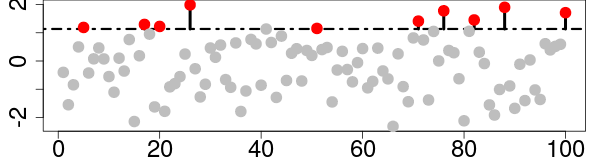
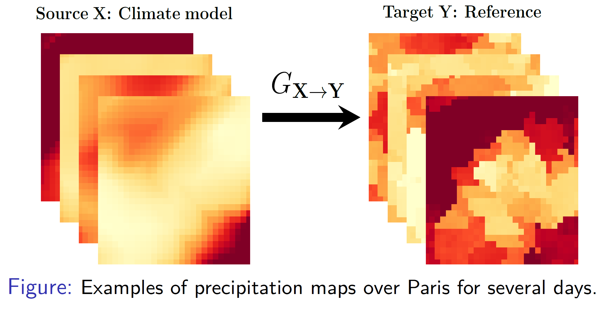

# Avant propos


Master en statistiques + thèse à CLS en sciences de environnement + Post-doc au CNRM.

Ingénieur de recherche au LSCE : Laboratoire des Sciences du Climat et de l’Environnement

Je travaille avec les chercheurs de l’équipe ESTIMR : 
Extrêmes : Statistiques, Impacts et Régionalisation

Ce cours reflète mon expérience personnelle dans les sciences du climat. Donc, ce n'est pas un cours exhaustif et surement avec des lacunes.

Merci donc aux différentes rencontres qui m'ont permit d'alimenter ce cours.

Une grande partie est notamment inspirée des cours de [Julien Cattiaux](https://www.umr-cnrm.fr/spip.php?article629). 

---
# Plan du jour

- Etude du climat : pourquoi les statistiques ?

- Focus sur deux domaines de la climatologie statistique :

  - la correction de biais,
  
  - la détection et attribution du changement climatique.

- TP sur l'attribution d'événements, si le temps le permet.

```{r, load_refs, include=FALSE, cache=FALSE}
library(RefManageR)
BibOptions(check.entries = FALSE,
           bib.style = "authoryear",
           style = "markdown",
           hyperlink = TRUE,
           dashed = TRUE,
           max.names = 1,
           longnamesfirst = FALSE)
myBib <- ReadBib("./biblio.bib", check = FALSE)
```


---
# Climat ou météo ? 

### Comment s'habiller demain ? 


---
# Climat ou météo ? 

### Comment construire sa maison ? 


---
# Le sytème climatique


# Le climat


En un lieu et un instant donnés,c’est ensemble des conditions météorologiques possibles.
L’ensemble des conditions météorologique possible résulte de l'interaction entre les
composantes du système climatique.

---
# définition de l'IPCC


**Climate:**

> Climate in a narrow sense is usually defined as the <font color="blue">*average weather*</font>, or more rigorously, as  <font color="blue">*the statistical description*</font> in terms of the  <font color="blue">*mean*</font> and  <font color="blue">*variability*</font> of relevant quantities over a period of time ranging from months to thousands or millions of years. 

> The classical period for  <font color="blue">*averaging*</font> these variables is 30 years, as defined by the World Meteorological Organization.

> The relevant quantities are most often surface variables such as temperature, precipitation and wind. 

> Climate in a wider sense is the state, including a  <font color="blue">*statistical description*</font>, of the climate system

[IPCC, 2013: Annex III: Glossary](https://www.ipcc.ch/site/assets/uploads/2018/02/WG1AR5_AnnexIII_FINAL.pdf)

---
# Climat et météo pour un statisticien


***Le climat est comme une distribution de probabilité et la météo  ses réalisations.***

---
# Systèmes chaotiques

**Chaotic:**

> A dynamical system such as the climate system, governed by nonlinear deterministic equations, may exhibit erratic or chaotic behaviour 

> very small changes in the initial state of the system in time lead to large and apparently unpredictable changes in its temporal evolution. 

> Such chaotic behaviour limits the predictability of the state of a nonlinear dynamical system at specific future times, 

> although changes in its statistics may still be predictable given changes in the system parameters or boundary conditions

[IPCC, 2013: Annex III: Glossary](https://www.ipcc.ch/site/assets/uploads/2018/02/WG1AR5_AnnexIII_FINAL.pdf)


---
# Exemple: le système de Lorenz

<p align="center">

<br/>
<a href="https://en.wikipedia.org/wiki/Image:TwoLorenzOrbits.jpg">from en.wikipedi.org</a>
</p>


---
# Exemple: prévision métérologique

<p align="center">

<br/>
<a href="https://en.wikipedia.org/wiki/Image:TwoLorenzOrbits.jpg">from en.wikipedi.org</a>
</p>

---
# Systèmes déterministes et aléas

<p align="center">

<br/>
<a href="https://journals.ametsoc.org/view/journals/bams/96/8/bams-d-13-00255.1.xml">credits: Kay et al. 2015
</a>
</p>


---
# Systèmes déterministes et aléas

Lorsque l'on simule l'évolution du climat au 20ème siècle, on ne connaît pas assez précisément les conditions initiales de l'ère pré-industrielle. 

Par exemple, la trajectoire de la température moyenne globale ne peut donc être exactement reproduite. 


<p align="center">

<br/>
<a href="(https://www.ipcc.ch/site/assets/uploads/2018/02/WG1AR5_Chapter10_FINAL.pdf">IPCC AR5, Fig. 10.1</a>
</p>


---
# Modélisation statistique


En modélisation statistique, la partie du signal que l’on pense être capable de prédire est souvent supposée déterministe.  Le reste est modélisé comme du bruit, i.e. par une variable aléatoire.

<br/>
Exemple: étude de tendance par régression linéaire: 

$$Y = a X + b + \epsilon$$
avec par exemple 

- $X$, le temps
- $Y$, la température
- $\epsilon$, du bruit


<!-- Pour comprendre ce qui peut être modélisé comme un signal déterministe ou comme du bruit, il faut connaître les différentes sources de variabilité climatique. -->

.footnote[Pour l'analyse de tendance, voir aussi [IPCC AR5, Chapter 2, Box 2.2, p 179](https://www.ipcc.ch/site/assets/uploads/2017/09/WG1AR5_Chapter02_FINAL.pdf
)]
---
# Décomposition de la variabilité climatique
 <br/>
<ul>
  <li style="list-style-type: none;">Climat = état moyen + variabilité climatique.</li> 
  <br/> <br/>
  <li style="list-style-type: none;">Variabilité climatique = variabilité interne + forçages externes.</li> 
  <br/> <br/>
  <li style="list-style-type: none;">Forçages externes = forçages naturels + forçages anthropiques.</li> 
  <br/> <br/>
  <li style="list-style-type: none;">Variabilité interne + forçages naturels = variabilité naturelle.</li> 
  <br/> <br/>
</ul>
 <br/>


.footnote[repris de Cattiaux, Système Climatique IENM, [notes](https://www.umr-cnrm.fr/IMG/pdf/cattiaux_climat_notes_de_cours-2.pdf
) et  [cours 3/10](https://www.umr-cnrm.fr/IMG/pdf/cattiaux_ienm_climat_03_print.pdf) (1A)]

---
# Différentes échelles temporelles
<p align="center">

<br/>
<a href="IPCC"</a>
</p>

---
# Bilan d'énergie
<p align="center">

<br/>
<a href="">source: IPCC AR6 & @YannWeb</a>
</p>


---
# Bilan radiatif
<p align="center">

<br/>
<a href="">source: IPCC AR4 </a>
</p>

---
# Forçages radiatifs

> Le terme de forçage climatique (ou forçage radiatif) désigne une perturbation d’origine extérieure au système climatique qui impacte son bilan radiatif. 


<a href="https://www.climat-en-questions.fr/reponse/fonctionnement-climat/forcage-climatique-par-david-saint-martin-olivier-boucher">climat-en-questions.fr </a>

---
# Forçages radiatifs


<p align="center">

<br/>
<a href="">source:IPCC AR6  </a>
</p>

---
# Modélisation statisque

<br/>
 
$$\underbrace{\text{Climat}}_{aléatoire} = \underbrace{\text{état moyen} +  \text{forçages externes}}_{déterministe} + \underbrace{\text{variabilité interne}}_{aléatoire}$$
 <br/>
 <dl>
  <dt>**réponse du climat aux forcages externes**</dt>
  <dd>- considérée comme déterministe </dd>
  <dd>- gouvernée par de grands équilibres physiques (bilan d'énergie)</dd>
  <br/><br/>
  <dt>**variabilité interne**</dt>
  <dd>- ce qui modifie la répartition de l'énergie à l'intérieur du système à l'équilibre</dd>
  <dd>- difficile à prévoir de par son charactère chaotique</dd>
  <dd>- considérée comme aléatoire</dd>
</dl>

---


# Différentes échelles temporelles

<br/>

<p align="center">

<br/>
<a href="https://www.umr-cnrm.fr/IMG/pdf/cattiaux_ienm_climat_03_print.pdf">de Cattiaux, Système Climatique IENM 3/10 (1A)</a>
</p>


<br/>


Par exemple, on peut modéliser des données horaires par:
$$
\begin{aligned}
\text{Climat} =  &\text{moyenne } +  \\
&\color{green}{\text{tendance}} +  \color{green}{\text{cycle saisonnier moyen}} +  \color{green}{\text{cycle diurne moyen }} + \\
&\color{blue}{\text{bruit}}
\end{aligned}
$$

---
# Modéliser le bruit

<br/>
- **Distribution**, e.g. gaussienne, uniforme...

<br/>
- **Dependance temporelle** (e.g. autocorrélation)

  - sans dépendance, e.g. [bruit blanc](https://en.wikipedia.org/wiki/White_noise#White_noise_vector)
  
  - avec dépendance, e.g. [processus autorégressif](https://en.wikipedia.org/wiki/Autoregressive_model), [processus moving-average](https://en.wikipedia.org/wiki/Moving-average_model)

<br/>
- **Stationnaire**: Les propriétés statistiques du bruit évoluent-elles dans le temps ?

---
# Dépendance temporelle
```{r, echo=FALSE, fig.height=5, dev='svg'}
n <- 500
par(mar = c(4, 4, 1, .1))
layout(matrix(c(1,1,2,3,4,5), 3, 2, byrow = TRUE))
ylim <- c(-3, 3)
X <- rnorm(2*n, 0, 1)
plot(X, xlab = "", type = "l", ylim = ylim, main = "i.i.d. gaussian")

ar1 <- 0.5
X <- arima.sim(list(order=c(1,0,0), ar=ar1), n=n)*sqrt(1-ar1^2)
plot(X, xlab = "", ylim = ylim, main = expression(paste("AR(1), ", phi, "=0.5")))


ar1 <- 0.9
X <- arima.sim(list(order=c(1,0,0), ar=ar1), n=n)*sqrt(1-ar1^2)
plot(X, xlab = "", ylim = ylim, main = expression(paste("AR(1), ", phi, "=0.9")))


ar1 <- 0.5
X <- arima.sim(list(order=c(0,0,1), ma=ar1), n=n)/sqrt(1+ar1^2)
plot(X, xlab = "", ylim = ylim, main = expression(paste("MA(1), ", theta, "=0.5")))


ar1 <- 0.9
X <- arima.sim(list(order=c(0,0,1), ma=ar1), n=n)/sqrt(1+ar1^2)
plot(X, xlab = "", ylim = ylim, main = expression(paste("MA(1), ", theta, "=0.9")))
``` 

---
# Fonction d'autocorrélation
```{r, echo=FALSE, fig.height=5, dev='svg'}
n <- 500
par(mar = c(4, 4, 1, .1))
layout(matrix(c(1,1,2,3,4,5), 3, 2, byrow = TRUE))
X <- rnorm(2*n, 0, 1)
plot(acf(X, plot = FALSE), main = "i.i.d. gaussian")

ar1 <- 0.5
X <- arima.sim(list(order=c(1,0,0), ar=ar1), n=n)*sqrt(1-ar1^2)
plot(acf(X, plot = FALSE), main = expression(paste("AR(1), ", phi, "=0.5")))


ar1 <- 0.9
X <- arima.sim(list(order=c(1,0,0), ar=ar1), n=n)*sqrt(1-ar1^2)
plot(acf(X, plot = FALSE),  main = expression(paste("AR(1), ", phi, "=0.9")))


ar1 <- 0.5
X <- arima.sim(list(order=c(0,0,1), ma=ar1), n=n)/sqrt(1+ar1^2)
plot(acf(X, plot = FALSE), main = expression(paste("MA(1), ", theta, "=0.5")))


ar1 <- 0.9
X <- arima.sim(list(order=c(0,0,1), ma=ar1), n=n)/sqrt(1+ar1^2)
plot(acf(X, plot = FALSE), main = expression(paste("MA(1), ", theta, "=0.9")))
``` 

---
# Stationarité ?
```{r, echo=FALSE, fig.height=5, dev='svg'}
n <- 1000
par(mar = c(4, 4, 1, .1))
par(mfrow = c(3, 1))
ylim <- c(-4, 4)

X <- rnorm(n, 0 + seq(0, 1, length.out = n), 1)
plot(X, xlab = "", type = "l", ylim = ylim, main = "non-stationnarité en moyenne")

X <- rnorm(n, 0, 1 + seq(0, 1, length.out = n))
plot(X, xlab = "", type = "l", ylim = ylim, main = "non-stationnarité en variance")

ar1 <- seq(0.3, 1, length.out = n)
for(i in 2:n){
  X[i] <-  (ar1[i] * X[i-1]  + rnorm(1)) / sqrt(1 + ar1[i]^2)
}
plot(X, xlab = "", , type = "l", ylim = ylim, main = "non-stationnarité en dependance temporelle")
``` 

---
# Le climat, un système à très grandes dimensions

<br/><br/>

Processus spatial et temporel multivarié et à grande dimension.

Comment le décrire, le visualiser et l'analyser ?

Quelles sont les principaux "mode de variabilité" ? 

Quelles sont les différentes échelles de temps et d'espaces des principaux processus ?

---
# Differentes échelles spatio-temporelles
<p align="center">

<br/>
</p>

---
# Mode de variabilité

> Structure spatio temporelle sous
jacente privilégiant une configuration spatiale et une variation temporelle, qui
contribue à la prise en compte des grandes caractéristiques de la variance et
des téléconnexions. On considère souvent qu’un mode de variabilité constitue
le produit d’une configuration spatiale du climat et d’une série chronologique
d’un indice climatique associé.

[IPCC, 2013: Annex III: Glossary](https://www.ipcc.ch/site/assets/uploads/2018/02/WG1AR5_AnnexIII_FINAL.pdf)
---
# Téléconnexion

> Téléconnexion Association statistique de variables climatiques entre des
zones géographiques fixes, éloignées les unes des autres. Les téléconnexions
découlent de vastes structures spatiales, notamment les modes couplés, à
l’échelle d’un bassin, de la variabilité océan-atmosphère, les trains d’ondes de
Rossby, les courants-jets et les rails des dépressions des latitudes moyennes,
etc.

[IPCC, 2013: Annex III: Glossary](https://www.ipcc.ch/site/assets/uploads/2018/02/WG1AR5_AnnexIII_FINAL.pdf)
---
# ENSO

<p align="center">

<br/>
<a href="https://psl.noaa.gov/enso/mei/
">Source NOAA</a>
</p>

---
# Indice ENSO défini par ACP

<p align="center">

</p>

---
# ENSO et teleconnexions

<p align="center">

<br/>
</p>

---
# En résumé

Le système climatique est une système complexe et chaotique que l'on peut voir (approximer) comme un processus stochastiques à grande dimension.

Les statistiques nous aident à décrire et à analyser ce système.

La modélisation statistique du climat est seulement une approximation: à quel point cette approximation doit être fidèle à la réalité ?

Selon l'application, choisir ce que l'on considère comme un signal déterministe ou comme du bruit:

- Quel modèle pour la partie déterministe ?

- Quel modèle pour le bruit ?

A partir de quels jeux de données ?

---
# Les données et leurs incertitudes.

<br/><br/>

Les observations

Les simulations climatiques

Les réanalyses

---
# Les observations

<p align="center">

<br/>
<a href="https://public.wmo.int/en/about-us/vision-and-mission/wmo-integrated-global-observing-system">Source WMO</a>
</p>


---
# Incertitudes dans les mesures

<br/>


> The uncertainty in observational records encompasses

>  - instrumental/recording errors.

> - effects of representation (e.g., exposure, observing frequency or timing).

> - effects due to physical changes in the instrumentation (such as station relocations or new satellites).


[IPCC AR5, Box 2.1](https://www.ipcc.ch/site/assets/uploads/2017/09/WG1AR5_Chapter02_FINAL.pdf
)
---
# Erreurs instrumentales:  altimétrie

<p align="center">

<br/>
<a href="http://www.altimetry.info/radar-altimetry-tutorial/data-flow/data-processing/geophysical-corrections/">Source: altimetry.info</a>
</p>


---
# Erreurs instrumentales:  altimétrie


**Error budget of Envisat Altimetry Mission**

Envisat Altimetry | Specified | Observed | Comments 
------------ | :------------- | :----------- | :----------- 
 Altimeter noise | 4.5cm | 2cm | Altimeter noise computed on post launch data
 Sea State Bias | 2cm | 0.5cm | SSB error estimated from differences between different empirical models. Value at 2m SWH. 
 Ionosphere  | 0.2cm  | 0.7cm |Derived from cross-sensor comparisons
 Dry troposphere | 0.7cm | 0.7cm | From uncertainties in ECMWF atmospheric fields used to derive the correction. Value at 2-3 hPa sea level pression. 
 Wet troposphere | 1.4cm | 1.5cm | Comparisons with ECMWF correction.
 Radial Orbit error| 2cm | 1.7cm | From POD operational monitoring

[Source: CLS](https://earth.esa.int/documents/700255/3528455/Error_Budget_Envisat_Altimetry_Mission.pdf)

---

# Erreurs instrumentales:  pluviomètre 


<p align="center">

<strong>Effet Venturi</strong>
<br/>

</p>

> les pertes attribuées au vent sont de l’ordre de 2 à 15% dans le cas de la pluie, 

> et pouvant atteindre 80% pour la neige (Sevrük, 1996). 

[Thèse Olivier Mestre (2010)](http://hydrologie.org/THE/MESTRE.pdf)

---

# Echantillonage

<p align="center">

<strong>Orbit de SWOT</strong>
<br/>


<a href=https://swot.jpl.nasa.gov/resources/89/swot-science-orbit/">C. Ubelmann, CLS (left, center) and JPL/NASA (right)</a>

</p>

---

# Echantillonage

<p align="center">
<strong>Station coverage for the CRU TS dataset </strong>
<br/>


<br/>

<a href="https://doi.org/10.1038/s41597-020-0453-3">Harris et al. (2020)</a>
</p>

---


# Homogénéité des séries climatologiques
<br/>

> Les séries climatologiques instrumentales sont le résultat de la superposition de deux signaux bien distincts : 

> − L’évolution climatique que l’on cherche à étudier.

> − Les ruptures dues à la modification des conditions de mesure. 

> Malheureusement, ces ruptures artificielles peuvent être du même ordre de grandeur que les caractéristiques climatiques que l’on veut mettre en évidence. 

> Les séries brutes sont la plupart du temps complètement faussées par ces anomalies, qu’il va falloir détecter, puis corriger.

[Thèse Olivier Mestre (2010)](http://hydrologie.org/THE/MESTRE.pdf)

---

# Homogénéisation relative

<p align="center">

<br/>
<a href="http://hydrologie.org/THE/MESTRE.pdf">Thèse Olivier Mestre (2010)</a>
</p>


---
# Homogénéisation relative

<p align="center">

<br/>
<a href="http://hydrologie.org/THE/MESTRE.pdf">Thèse Olivier Mestre (2010)</a>
</p>

---
# Homogénéisation : effet sur les tendances 

<p align="center">

<br/>


<br/>
<a href="http://hydrologie.org/THE/MESTRE.pdf">Thèse Olivier Mestre (2010)</a>
<br/>
</p>

---
# Spatialisation des données

<p align="center">

<br/>

<br/>

<br/>
<a href="https://doi.org/10.1038/s41597-020-0453-3">Harris et al. (2020)</a> et 
<a href="https://www.globalclimatemonitor.org">www.globalclimatemonitor.org</a>
<br/>
</p>


---
# Qualité de l'interpolation

<p align="center">
<strong>Evaluation par <a href="https://en.wikipedia.org/wiki/Cross-validation_(statistics)"> cross-validation </a> </strong>

<br/>

<br/>
<a href="https://doi.org/10.1038/s41597-020-0453-3">Harris et al. (2020)</a> 
<br/>
</p>

---

# Aucun jeu d'observations n'est parfait.

<br/>
Quelle est la précision des mesures et leur biais ?

<br/>
Quelle est l'échantillonnage spatiale et temporel ?

<br/>
Y a-t-il des ruptures dans les séries temporelles ?

<br/>
Comment est évaluée la qualité des données et quels sont les post-traitements appliqués ?


---
# Les simulations climatiques

<p align="center">
<strong> Le système climatique </strong>
<br/> Quelles approximations sommes nous prêts à faire ?

<br/>
<a href="http://www.ipcc.ch/publications_and_data/ar4/wg1/en/contents.html">Source: IPCC AR4, FAQ 1.2, Figure 1. </a>
<br/>
</p>
---

# Quelles composantes modéliser ?

<p align="center">

<br/>
<a href="http://www.ipcc.ch/publications_and_data/ar4/wg1/en/contents.html">Source: IPCC AR4, Figure 1.2 </a>
<br/>
</p>

---
# A quelle résolution ?

<p align="center">

<br/>
<a href="http://www.ipcc.ch/publications_and_data/ar4/wg1/en/contents.html">Source: IPCC AR4, Figure 1.4 </a>
<br/>
</p>

---
# Et les processus sous-maille?


.pull-left[
**Paramétrage:** *Etablir des relations entre les variables à grande échelle effectivement modélisées et les effets de ces processus sous-mailles, dont on établit la moyenne pour une zone ou une durée donnée.*

<br/>

The differences between parametrizations are an important reason why climate model results differ. 
]

.pull-right[

]

Sources: 
[IPCC, 2013: Annex III: Glossary](https://www.ipcc.ch/site/assets/uploads/2018/02/WG1AR5_AnnexIII_FINAL.pdf), 
[IPCC AR4 (2007), Chapter 8, 8.2.1.3 Parametrizations](http://www.ipcc.ch/publications_and_data/ar4/wg1/en/contents.html) et figure de 
[Ruddiman (2007)](https://www.macmillanlearning.com/college/us/product/Earths-Climate/p/1429255250)


---
# Influence sur la varibilité interne

<p align="center">

<br/>
<a href="https://doi.org/10.1098/rsta.2014.0426">Sutton et al. (2015)</a>
<br/>
</p>


---
# Influence sur la sensibilité climatique


<p align="center">

<br/>
<a href="https://www.ipcc.ch/site/assets/uploads/2018/02/WG1AR5_Chapter09_FINAL.pdf">IPCC AR5, Figure 9.43</a>
<br/>
</p>

A voir également: cours de [Brian E. J. Rose](https://brian-rose.github.io/ClimateLaboratoryBook/courseware/sensitivity-feedback.html) et de [Goosse et al.](https://www.climate.be/textbook/chapter4_node4.xml)

---
# et les projections climatiques

<p align="center">

<br/>
<a href="https://www.ipcc.ch/site/assets/uploads/2018/02/SYR_AR5_FINAL_full.pdf">IPCC AR5, Figure SPM.6</a>
<br/>
</p>

---
# Décomposition de l'incertitude

<p align="center">

<br/>

<br/>

<br/>

<br/>
<a href="https://doi.org/10.5194/esd-11-491-2020">Lehner et al. (2020)</a>
<br/>
</p>

---
# Modèles régionaux

<p align="center">

<br/>
<a href="https://doi.org/10.1146/annurev-environ-102014-021217">Giorgi et Gutowski Jr. (2015)</a>
<br/>
</p>

---
# Décomposition de l'incertitude

<p align="center">


<br/>

<br/>
<a href="https://doi.org/10.1175/JCLI-D-18-0606.1">Evin et al. (2019)</a>
<br/>
</p>

---
# Aucun modèle n'est parfait
 
 <br/><br/>
 
Quelles approximations est-on prêt à faire, en particulier vis-à-vis de la résolution et des processus explicitement modélisés ?

Où se situent les simulations d'un modèle par rapport aux autres? et par rapport aux observations ?

---
# Reanalysis

> Reanalyses are estimates of historical atmospheric temperature and wind or oceanographic temperature and current, and other quantities, 

> created by processing past meteorological or oceanographic data using fixed state-of-the-art weather forecasting or ocean circulation models with data assimilation techniques. 

> Using fixed data assimilation avoids effects from the changing analysis system that occur in operational analyses. 

> Although continuity is improved, global reanalyses still suffer from changing coverage and biases in the observing systems.

[IPCC, 2013: Annex III: Glossary](https://www.ipcc.ch/site/assets/uploads/2018/02/WG1AR5_AnnexIII_FINAL.pdf)

---
# Data assimilation

> DA is the approximation of the true state of some physical system at
a given time by combining time-distributed observations with a dynamic model in an
optimal way.

[Asch et al. 2016](https://hal.inria.fr/hal-01402885)
<p align="center">

<br/>
<a href="https://doi.org/10.1175/JCLI-D-18-0606.1">Source: RIKEN</a>
<br/>
</p>

---
# Le cycle d'assimilation

Pour simuler un système chaotique, la connaissance des condition initiales est essentielle, d'où l'importance de l'assimilation pour la prévision du temps.


<p align="center">

<br/>
<a href="https://hal-imt-atlantique.archives-ouvertes.fr/hal-01867958">Tandeo et al. (2018)</a>
<br/>
</p>

---

# Plus formellement
<p align="center">

<br/>
</p>

La physique est nécessaire pour la modélistion des opérateurs $M$ et $H$.

La statistique est nécessaire pour la modélisation des bruits $\eta$ et $\epsilon$.

On cherche l'état de l'atmosphère $x$ qui minimise une fonction de coût.  Pour la 3D-VAR:

$$J(x) = \frac{1}{2} \Vert x - x^b \Vert_{Q{-1}}^2 + \Vert y - H(x) \Vert_{R^{-1}}^2$$


[Source: Boquet et al. (2018)]("https://sama.sciencesconf.org/data/program/sama2018_bocquet_1.pdf")


---

# Des analyses vers les réanalyes
> Integration of an invariant, modern version of a data assimilation system and numerical weather prediction model,
over a long time period, assimilating a selection of observations


Homogénéité essentielle pour l'étude du climat.

- Attention aux biais du modèle et des observations

- Effet de l'intégration de nouvelles sources d'observations.

<p align="center">

<br/>
</p>

[Source: Poli (2011)](https://www.ecmwf.int/sites/default/files/elibrary/2012/11694-data-assimilation-atmospheric-reanalysis.pdf),
voir aussi [Parker (2016)](https://doi.org/10.1175/BAMS-D-14-00226.1) et la discussion qui en découle.


---
# Aucun jeu de données n'est parfait.


Tous possèdent des incertitudes qui leurs sont propres.

Il faut donc s'en accommoder.

Important de sélectionner les jeux de données appropriés à sa problématique posée et d'en considérer les limites.

Les statistiques peuvent être un outil privilégié pour exprimer et prendre en compte ces incertitudes.


---
# Detection et attribution du changement climatique

### Objectifs

Présenter la problématique de la détection et attribution.

Présenter quelques facons de répondre à ce type de problématique.

En grande partie, on parlera des travaux de :
 - l'équipe ESTIMR du LSCE <br/>
 *Pascal Yiou, Davide Faranda, Philippe Naveau, Robert Vautard* 
 
 - l'équipe AMACS du CNRM <br/>
 *Aurelien Ribes, Julien Cattiaux*

Pour creuser d'avantage voir les publications des deux équipe, 
en particulier ceux d'Aurelien Ribes, notamment sa thèse.

---
# Detection et attribution du changement climatique

#### Détection:
> le processus consistant à démontrer que le climat ou un système sous l’effet du climat a changé selon certains critères statistiquement définis, sans donner la raison de
ce changement. Un changement déterminé est détecté dans les observations s’il
est établi que sa probabilité d’occurrence par un hasard découlant uniquement
de la variabilité interne est faible – inférieure à 10 % par exemple. 

#### Attribution
> le processus consistant à évaluer les contributions relatives des différents
facteurs déterminants d’un changement ou d’un phénomène, en précisant un
degré de confiance statistique (Hegerl et al., 2010).

.footnote[[IPCC AR5, Glossaire](https://www.ipcc.ch/site/assets/uploads/2018/08/WGI_AR5_glossary_FR.pdf)]


---
# Attribution et causalité

Déterminer s'il y a un lien de causalité entre les activités humaines et les variations du climat:

.center[$\Rightarrow$ notions d'intervention et de countrefactuel]


.pull-left[
	.center[
	  <font color="purple"> <strong>factual world</strong> </font>
     
  ]
]
.pull-rigt[
	.center[
	  <font color="green"> <strong> counterfactual world     </strong></font>
  	 
  ]
]

			
<br><br>


.footnote[source: [Hannart et al. 2016.](https://doi.org/10.1175/BAMS-D-14-00034.1)]

---
# Importance des modèle de climat en D&A 

#### Counterfactual
Jamais observé en pratique


#### Intervention 
Nécessite un groupe expérimental et un groupe de contrôle: impossible avec une seule Terre

#### Solution ? 
Utiliser les modèles de climats pour faire des expériences contrôlées.   
.center[
   
]

---
# Comparer des distributions


.center[
     
  	 
]


---
# A travers différents obsvervables

.center[
   
   
]

---
# D&A des tendances long-termes

</br>

1.  Montrer que le signal n’est pas cohérent avec le seule variabilité interne (détection).

2.  Montrer que le signal est cohérent avec la réponse attendue à un
ensemble de causes qui contient la cause $i$ (cohérence avec les causes).

3.  Montrer que le signal n’est pas cohérent avec la réponse attendue sans les
causes $i$ (autres causes possibles ?).    

---
# Avec les mains 


---
# Le modèle statistique classique 

</br>


$$Y^* = \mu + \sum_{i = n}^N \beta_i X_i^*$$
où $Y^*$ est la réponse forcée du climat à l'ensemble des forçages.
$X_i^*$ est la réponse du climat au forçage $i$.

On fait donc l'hypothèse d'additivité des réponses aux différents forçages. Par exemple, pas d’interaction entre les différents forçages.


---
# Le modèle statistique classique 

$$Y^* = \mu + \sum_{i = n}^N \beta_i X_i^*$$

On observe en pratique:
$$\left\{
    \begin{array}{ll}
       Y = Y^* + \varepsilon_y \\
       X_i = X_i^* + \varepsilon_{x_i} \quad \text{pour } i = 1, ..., N.\\
    \end{array}
\right.$$

$Y$ l'état du climat à un instant donnée, donc influencé par la variabilité interne $\varepsilon_y$. $Y$ sont des observations.

$X_i$ est une réponse au forçages $i$ simulé par un modèle climat, qui est donc aussi influencé par la variabilité interne $\varepsilon_{x_i}$.

C'est donc un modèle de type "**Errors-in-variables models**".

---
# Interpreter les coefficients $\beta_i$:

$$Y^* = \mu + \sum_{i = n}^N \beta_i X_i^*$$
Test pour la détection du forçage anthropique:

$$\left\{
    \begin{array}{ll}
       H_0 : & \beta_i = 0 \quad \text{pour } i = 1, ..., N.\\
       H_1 : & \beta_{ant} > 0, \quad \beta_i = 0  \quad \text{pour } i \neq. ant.
    \end{array}
\right.$$


Test de cohérence:
$$\left\{
    \begin{array}{ll}
       H_0 : & \beta_i = 1 \quad  \text{pour } i = 1, ..., N.\\
       H_1 : & \text{il existe au moins un } \beta_{i} \neq 1.
    \end{array}
\right.$$

Test des autres causes plausibles:
$$\left\{
    \begin{array}{ll}
       H_0 : & \beta_{ant} = 0 \\
       H_1 : & \beta_{ant} > 0 
    \end{array}
\right.$$

---
# Attribution d'événements météorologiques

.center[] 

---
#  Définir l'événement

</br>


1. Définir la variable climatique d'intérêt. <br/>
<em>e.g. temperature, precipitation, ... </em> 

2. Définir le degré d'aggrégation spatiale et temporelle. <br/>
<em>e.g. maximum en  Europe de moyenne sur 10 jours des température</em> 

3. Définir le conditionnement. <br/>
<em>e.g. seulement en été, ou pour la circulation atmosphérique de type NAO+, ...</em> 

4. Définir la statistique d'intérêt. <br/> 
<em>.e.g. dépassement de seuil</em> 


.footnote[
  Pour en savoir plus: [Cattiaux, J. and A. Ribes, 2018](https://doi.org/10.1175/BAMS-D-17-0281.1) 
]

---
# Estimer la probabilité d'un événement

</br>

1. Simuler le climat dans le monde factuel et contrefactuel. 

2. Estimer la probabilité de l'événement dans les deux mondes, $p_1$  and $p_0$:
  <br>
  - En comptant le nombre d'événements apparaissant dans les  simulations, <br>
		<em> demande un large ensemble de simulation pour avoir une estimation précise. </em>

	- En ajustant un modèle statistique    
		<em> demande de faire des hypothèses sur la distribution des données. </em>
		
		
---
#  Choice of the statistical distribution

Approximer la distribution (théorie asymptotique):

- Central Limit Theorem: <em>sum, average</em> -> Gaussian distribution.

- Extreme Value Theory:
  - <em> block maxima </em> ->  Generalized extreme value distribution (GEV)<br>
		
								
	- <em> peak over threshold </em> -> Generalized Pareto distribution (GPD)<br>    
		
						
.footnot[Source: [Coles, 2001](http://dx.doi.org/10.1007/978-1-4471-3675-0)]


---
# Loi d' extremum généralisée

Generalized Extreme Value distribution (GEV)
					
$$M_n = max\{X_1 , ... , X_n\},$$
où $X_l, ... , X_n$, est une séquence de variables aléatoires indépendantes et de fonction de répartition $F$.

**Théorème.**
					
Si il existe  une séquence de constantes $\{a_n > 0\}$ et  $\{b_n\}$ tel que
$$\mathbb{P}\{(M_n - b_n)/a_n \leq z \} \rightarrow G(z) \text{ as } n \rightarrow \infty $$  

où  $G$ une fonction de répartition non-dégénérée, alors $G$ appartient à famille des distributions GEV

$$G(z) = \exp\left\{-\left[1 + \xi \left(\frac{z - \mu}{\sigma}\right)\right]^{-1/\xi}\right\},$$

définie sur $\{z : 1 + \xi (z - \mu) / \sigma \geq 0\}$, avec $-\infty < \mu < \infty$, $\sigma > 0$ et 	$-\infty < \xi < \infty$


---
# Loi de pareto genéralisée

Generalized Pareto Distribution (GPD)

$$(X - u) | (X > u) $$

où X a pour fonction de répartition $F$

**Théorème.**
Si lorsque  $n \rightarrow \infty$, $M_n = \max\{X_1 , ... , X_n\}$ converge en distribution vers $G$ appartenant à la famille GEV, alors pour $u$ assez grand,  la fonction de répartition de  $(X - u) | (X > u)$  peut être approximée par 

$$H(y) = 1 - \left(1 + \frac{\xi y}{\tilde{\sigma}} \right)^{-1/\xi}$$

définie sur $\{y : y > 0$ avec $(\xi y / \tilde{\sigma}) > 0 \}$


---
# Loi de pareto genéralisée

 **Remarques**.  On a une correspondance avec les paramétrés da la distribution GEV
 
 - $\tilde{\sigma} =  \sigma + \xi (u - \mu)$  
 
 - le paramètre de forme est le même que celui de la GEV associée.
 
 - le paramètre de forme  $\xi$, aussi appelé 'indice des valeurs extrêmes', caractérise le comportement de la queue de distribution: 
    - $\xi < 0$, la  distribution a une borne supérieure égale à $\mu - \tilde{\sigma} / \xi$ 
    - $\xi = 0$, la distribution a une queue à décroissance exponentielle. On interprète ce cas comme la limite de $\lim_{\xi \rightarrow 0} H(y)$
    - $\xi > 0$, la distribution est à queue lourde. 
    
    
---
# Cas d'étude: vague de chaleur de 2003 `r Citep(myBib, "ribes_describing_2020")` 

<h3> Variable of interest,  $Y$ </h3>
					<p style="margin-left:2em">
					Température moyenne sur le mois de juillet dans la région de Paris, i.e. [45N - 50N] x [0E -5E] <br>
					Les températures sont exprimées en termes d'anomalies par rapport à la climatologie de  1961-1990.
					</p>

<h3> Event definition </h3>
					<p style="margin-left:2em">
				  $$\{Y \geq u\}$$ where $u = +5.38^{\circ}$C, l'anomalie de température observée en aout 2003.
					</p>
					

---
# Données

Simulations du modèles  CNRM-CM5  réalisées dans le cadre du projet "Coupled Model Intercomparison Project 5" (CMIP5). 

On extrait les données des expériences: 

- <strong>historical</strong>, pour représenter le climat du monde factuel (1850-2005)

- <strong>rcp8.5</strong>, qui sont des projections climatiques pour le future climat du monde factuel (2006-2100)


<strong> Remark. </strong> Dans cette étude, pas de simulations "historical-nat" pour représenter le  <font color="green"><strong> monde countrefactuel  </strong></font> 
 
					
---
# Statistical Model for $Y$

Pour le <font color="purple"><strong>monde factuel</strong></font>, 


$$Y_t \sim  \mathcal{N}\{\mu_0 + \mu_1 \color{purple}{X_{all}}(t), \sigma_0 \left[1 + \sigma_1 \color{purple}{X_{all}}(t)\right]\}$$ 

où $\color{purple}{X_{all}}$ est la réponse déterministe de la variable climatique variable $X$ aux forçages externes. On suppose que $X$ est un indicateur de l'intensité du changement climatique.

$$X(t) = \color{purple}{X_{all}}(t) + \epsilon_t = \color{red}{X_{ant}}(t) + \color{green}{X_{nat}}(t) + \epsilon_t$$

où $\epsilon_t$ est un bruit représentant la variabilité interne du climat.

Pour le  <font color="green"><strong> monde countrefactuel</strong></font>, 

$$Y_t \sim  \mathcal{N}\{\mu_0 + \mu_1 \color{green}{X_{nat}}(t), \sigma_0 \left[1 + \sigma_1 \color{green}{X_{nat}}(t)\right]\}$$ 


---
# Décomposition de la covariable $X$ 

 

---
# Ajustement du model gaussien

 
					
---
# Probabilité de l'événement

 
					
---
# Et avec les autres modèles climatiques ?

 


---
# Correction de bias

### Objectifs

Une courte introduction pour :
  
  - présenter la philosophie et principes généraux,
  
  - parler de quelques considérations pratiques sur la correction de biais et son évaluation.
  
Donc, ce n'est pas un cours exhaustif: toutes les méthodes et variantes ne seront pas traitées.

---
# Acknowledgement

Cette présentation est fortement inspirée par les présentations et les papiers de :

- Mathieu Vrac (LSCE)

- Bastien François (LSCE -> KNMI)

- Douglas Maraun (Uni Graz)

- IPCC AR6 WGI Ch10 <sup>1</sup>

.footnote[[1] `r Citet(myBib, "IPCC_2021_WGI_Ch_10")` ]

---
# Les modèles de climat sont essentiels

.left-column[
     
]

.right-column[
Ils permettent
  
  - d'explorer les climats passés et futures,
    
  - de faire des expériences et tester des hypothèses,

  - de servir de base pour développer des politiques d'atténuation et d'adaptation... 
    
... mais ils sont imparfaits et présentent des biais.
]
    

---
# Biais d'un modèle de climat 

</br></br>

> A climate model bias can be defined as the systematic  difference between a simulated climate statistic and the corresponding real-world  climate statistic


`r Citet(myBib, "maraun_bias_2016")`]


---
# Example de biais


.footnote[source: `r Citet(myBib, "eyring_esmvaltool_2016")`]

---
# Example de biais


.footnote[source: `r Citet(myBib, "li_changes_2021")`]

---
# Example de biais


.footnote[source: `r Citet(myBib, "li_changes_2021")`]


---
# Le climat comme une variable aléatoire multivariée

<br/></br>

Un processus spatio-temporelle multivarié.

Un modèle parfait ne serait biaisé pour aucune statistique.

Le modèle de climat et le vrai climat devraient donc avoir la même distribution de probabilité.

---
# Bias correction (BC)

<br/></br>


> Bias adjustment is a  statistical post-processing technique used to   pragmatically reduce the mismatch between the statistics of climate model output and observations. 

`r Citet(myBib, "IPCC_2021_WGI_Ch_10")`


---
# Model Output Statistics

Trouver comment transformer une variable aléatoire $X$ en une variable aléatoire $Y$.

Soit $X \sim F$ et $Y \sim G$,

i.e. $X$ et $Y$ suivent les lois de probabilités qui sont définis respectivement par les fonctions de répartition $F$ et $G$.

<br/>

On cherche une transformation $T$ tel que

$$ T(X) \buildrel d \over = Y \quad \Leftrightarrow \quad T(X) \sim G$$

ou en tous cas que la loi de $T(X)$ se rapproche de la loi de $Y$.

$$\mathrm{dist}( T(X), Y ) < \mathrm{dist}(X, Y)$$

Par exemple, en corrigeant l'espérance ou la variance.

 

---
# En pratique

</br>
On ne corrige pas toutes les variables d'un modèle de climat d'un coup. 

</br>
On en choisit un petit nombre et on définit les propriétés statistiques à corriger en fonction de ce qui nous parait important.

</br>
On ne connait pas les distribution de $X$ et $Y$, on observe seulement des réalisations de  $X$ et $Y$.


</br>
Les observations et les simulations climatiques ne sont pas appareillé: il y a pas de correspondance jour à jour des évènements météorologiques
$\rightarrow$ on travail sur uniquement sur les statistiques $\neq$ régression.

---
# Rappels sur les variables aléatoires continues

La distribution d'une variable aléatoire univariée et continue $X$ est entièrement déterminée par sa fonction de répartition (cumulative distribution function) 

$$F(x) = Pr (X \le x) $$
    
**Remarque** : on dit que $x_\alpha$ est le quantile de niveau $\alpha$ si $F(x_\alpha) = \alpha$
    
Si $F$ est une fonction continue, alors il existe une fonction positive $f$, appelé la densité de probabilité (probability density function) tel que

$$Pr(a\le X\le b) = F(b) - F(a) = \int_a^b f(x)\,dx$$.

---
# cdf and pdf


---
# Empirical estimator of the cdf

Soit $(X_1, ..., X_n)$ des variables aléatoires réelles, indépendantes et identiquement distribuées (i.i.d.) ayant pour cdf $F$. 

On définit la fonction de répartition empirique (empirical cumulative distribution function) par 

$$\widehat F_n(x) =  \frac{1}{n} \sum_{i=1}^n \mathbf{1}_{X_i \le x}.$$


---
# Egalité en distribution

Deux variables aléatoires réelles X et Y sont égales en distribution si et seulement si elles ont la même fonction de répartition :
    
$$X \stackrel{d}{=} Y \Leftrightarrow \operatorname{P}(X \le x) = \operatorname{P}(Y \le x)\quad\text{for all }x$$
Pour comparer deux échantillons, on peut se baser sur les diagnostiques graphiques suivants :  
    


---
# Univariate bias correction

</br></br>

- Ajustement de la moyenne

- Quantile mapping

---
# Correction de la moyenne
La variable large échelle $X$ est simplement transformée pour avoir la même espérance (moyenne) que la variable $Y$.

Ainsi pour une valeur $X_{new}$, la prédiction pour la valeur de $Y_{new}$ correspondante est donnée par 
$$\hat{Y}_{new} = X_{new} - \mathbb{E}[X] + \mathbb{E}[Y]$$

En pratique, on remplace l'espérance par la moyenne empirique
$$\hat{Y}_{new} = X_{new} - \bar{X} + \bar{Y}$$
en définissant la moyenne empirique de $X$ par 
$$\bar{X} = \frac{1}{n} \sum_{i=1}^{n} X_i$$

---
# Exemple synthetique


---
# La correction quantile-quantile (quantile mapping)

Soit $X \sim F$ et $Y \sim G$

On cherche une transformation $T$ tel que

$$ T(X) \buildrel d \over = Y \quad \Leftrightarrow \quad T(X) \sim G$$

Si $F$ et $G$ sont des fonctions de répartition continues et strictement monotones, alors 
$$ G(Y) \buildrel d \over = U(0,1) \buildrel d \over = F(X) $$
et 
$$ Y  \buildrel d \over = G^{-1}(F(X)) \buildrel d \over = T(X) $$

---
# Exemple synthetique


---
# Dans un contexte de changement climatique


</br></br>

|     | Present        | Future                                    |
|-----|----------------|-------------------------------------------|
| GCM | $X_0 \sim F_0$ | $X_1 \sim F_1$,                           |
| Obs | $Y_0 \sim G_0$ | $\color{orange}{Y_1 \sim G_1}$                    |

.center[
$\color{orange}{Y_0 \sim G_0}$ est inconnu.
]
---
# Quantile Mapping en changement climatique

On suppose que la fonction de correction est stationnaire:

$$Y_0 \buildrel d \over = G_0^{-1}(F_0(X_0)) \buildrel d \over = T(X_0)$$
$$\color{orange}{Y_1  \buildrel d \over = G_0^{-1}(F_0(X_1)) \buildrel d \over = T(X_1)}$$
  
$\Rightarrow$ on suppose les qq-plots stationnaires.
    
</br>
L'évolution du GCM (de $F_0$ vers $F_1$) n'est pas prise en compte. 
    
La tendance du GCM sur les quantiles n'est par préservée après correction.


---
# CDF-t `r Citep(myBib, "michelangeli_probabilistic_2009")`

> Cumulative Distribution Function - transform

On suppose qu'il y a une fonction  $T:[0, 1] \rightarrow[0, 1]$ telle que pour  tout $x \in \mathbb{R}$
    
$$G_0(x) = T(F_0(x)) \quad \text{et} \quad \color{orange}{ G_1(x) = T(F_1(x))}.$$

$\Rightarrow$ stationnarité du the pp-plot.

Une fonction $T$ qui satisfait  $G_0(x) = T(F_0(x))$ est
$$T(u) = G_0(F_0^{-1}(u)).$$
En effet, 
$$G_0(x) = G_0 \circ F_0^{-1} \circ F_0(x).$$
On suppose alors
$$\color{orange}{ G_1(x) = G_0 \circ F_0^{-1} \circ F_1(x)}.$$
---
# CDF-t

On applique alors le quantile mapping en se servant de  $F_1$ and $G_1$,

$$\begin{align}
  Y_1 & \buildrel d \over =\color{orange}{ G_1^{-1}} \circ F_1(X_1) \\
      &  \buildrel d \over =\color{orange}{ (G_0 \circ F_0^{-1} \circ F_1)^{-1}} \circ F_1(X_1) \\
      &  \buildrel d \over = \underbrace{\color{orange}{F_1^{-1} \circ F_0}}_{\text{apply GCM evolution}} \circ \underbrace{\color{orange}{G_0^{-1}} \circ F_1(X_1)}_{\text{QM into present obs}} \\
\end{align}$$

La tendance du GCM sur les quantiles n'est par préservée après correction.


---
# DQM `r Citep(myBib, "cannon_bias_2015")`

>Quantile Delta Mapping
    
----
Additive Quantile Delta Mapping:
  
$$\color{orange}{Y_1  \buildrel d \over =}  \underbrace{\color{orange}{G_0^{-1} \circ F_1(X_1)}}_{\text{QM into present obs}}   \color{orange}{+} \underbrace{ \color{orange}{X_1 - F_0^{-1} \circ F_1(X_1)}}_{\text{additive delta}}$$
</br>

----
Multiplicative Quantile Delta Mapping:

$$\color{orange}{Y_1  \buildrel d \over =}  \underbrace{\color{orange}{G_0^{-1} \circ F_1(X_1)}}_{\text{QM into present obs}}  \color{orange}{\times} \underbrace{ \color{orange}{\dfrac{X_1}{F_0^{-1} \circ F_1(X_1)}}}_{\text{multiplicative delta}}$$


---
# Quelques considérations pratiques

----  

$$\begin{align}
\text{QM}:  \quad  &Y_1   \buildrel d \over = G_0^{-1}(\color{red}{F_0(X_1)})\\
\text{CDFt}: \quad  &Y_1  \buildrel d \over = F_1^{-1} \circ \color{red}{ F_0 \circ G_0^{-1}} \circ F_1(X_1)
\end{align}$$

----
Attention aux supports des distributions !

En utilisant la fonction de répartition empirique, on a des supports finis

Comment extrapoler en dehors de la plage de valeurs observées ?

    
---
# Multivariate bias correction (MBC): corriger quoi ?

- Variables individuelles (marginales), </br>
  *e.g. température à point de grille.*

- Structure de dépendance inter-variable, </br>
  *e.g. temperature et precipitation à un point de grille.* 
  
- Structure de dépendance spatiale,  </br>
  *e.g. correlation des températures entre deux points de grille.*
        
- Structure de dépendance temporelle, </br>
  *e.g. persistence de jours secs, l'auto-correlation.*


---
# MBC configurations


<p align="center">

</p>


---
# Marginales et structure de dépendance.

### Théorème de Sklar  (1959)

Toute fonction de répartition multivariée, 
$$H(x_1,\dots,x_d)=\Pr[X_1\leq x_1,\dots,X_d\leq x_d],$$
d'un vecteur aléatoire $(X_1,X_2,\dots,X_d)$ 
peut s'exprimer en fonction des ses lois marginales 
$F_i(x_i) = \Pr[X_i\leq x_i]$ et d'une copule $C$,
        $$ H(x_1,\dots,x_d) = C\left(F_1(x_1),\dots,F_d(x_d) \right).$$

<br/>
De plus, si la loi multivariée  $H$ admet une densité $h$, 
$$h(x_1,\dots,x_d)= c(F_1(x_1),\dots,F_d(x_d))\cdot f_1(x_1)\cdot\dots\cdot f_d(x_d)$$ 

où $c$ est la densité de probabilité associée à la copule $C$.

---
# Mêmes marginales mais copules différentes


---
# Mêmes copules mais marginales differentes


---
# Copule empirique

La fonction copule,  $C:[0,1]^d\rightarrow [0,1]$, peut être estimer par la copule empirique:

$$\begin{align}
C^n(u_1,\dots,u_d) & = \frac{1}{n} \sum_{i=1}^n \mathbb{1}\left(\hat{F}_1(X_1^i)\leq u_1,\dots,\hat{F}_d(X_d^i)\leq u_d\right)\\
& = \frac{1}{n} \sum_{i=1}^n \mathbb{1}\left(R_1^i/n
\leq u_1,\dots, R_d^i/n \leq u_d\right)
\end{align}$$

où $R_k^i$ est le rang de l'observation $X_k^i$,

$$R_k^i=\sum_{j=1}^n \mathbb{1}(X_k^j\leq X_k^i).$$
Regarder la structure de rangs des données revient à regarder la copule empirique.


---
# R2D2 `r Citep(myBib, "vrac_multivariate_2018")`

>Rank Resampling for Distributions and Dependences bias correction

    
Rééchantilloner les simulations des modèles pour qu'ils aient la même copule empirique que les observations.
 
On suppose que la structure de dépendance est stationnaire.


---
# R2D2

Calculer la copule empirique.

<p align="center">

</p>

---
# R2D2

Choisir une dimension de référence, ici la dimension 1.

<p align="center">

</p>

---
# R2D2

Reproduire l'association de rangs des observations.

<p align="center">

</p>

---
# R2D2

Reproduire l'association de rangs des observations.

<p align="center">

</p>

---
# R2D2

Reproduire l'association de rangs des observations.

<p align="center">

</p>

---
# R2D2

Remettre les marginales.

<p align="center">

</p>

---
# Quelques remarques

Quand on modifie la structure de rangs entre les variables ou les sites,

&nbsp;&nbsp;  $\rightarrow$ on modifie la séquence temporelle de chaque variables,
  
  
&nbsp;&nbsp;  $\rightarrow$ on modifie les propriétés temporelles de ces variables.
    
<br/>  
Avec R2D2, seule la dimension de référence conserve sa structure temporelle de rang, donc les propriétés temporelle du GCM. 


---
# dOTC  `r Citep(myBib, "robin_multivariate_2019")`

> dynamical Optimal Transport Correction

----

### Optimal Transport

Trouver un plan de transport $\pi^*(x, y)$ qui déplace les masses de $x$ vers $y$ de telle sorte que la distribution  $\mu$ soit transformée en une distribution  $\nu$ tout en minimisant la somme des coûts de transport $c(x, y)$
    
$$\pi^*(x, y) = \inf_{\pi \in \Pi(\mu, \nu)} \iint c(x,y) \pi(x,y) \, \mathrm{d} x \, \mathrm{d} y$$ 
    
où $\Pi (\mu ,\nu )$ est l'ensemble des distribution jointe ayant pour lois marginales $\mu$  et  $\nu$.

---
# Transport plan


<p align="center">

<br/>
<a href="https://commons.wikimedia.org/wiki/File:Transport-plan.svg"> source: Wikimedia Commons</a>

Les distributions de $\mu$ and $\nu$ sur les axes x et y, et une distribution jointe entre $\mu$ and $\nu$ qui définit un plan de transport possible. 

---
# Optimal Transport plan

<p align="center">

<br/>
<a href="http://alexhwilliams.info/itsneuronalblog/2020/10/09/optimal-transport/"> source: alexhwilliams.infos</a>

    
**Remarque**. En une dimension, la solution du transport optimal est la correction quantile-quantile.


---
# dOTC


---
# dOTC en changement climatique

<p align="center">

</p>


---
# BC and ML

Ces dernières années, beaucoup de progrès dans les modèles génératifs (e.g. GAN, VAE, normalizing flow, diffusion models)

En particulier pour les problèmes de "Unpaired Image-to-Image Translation" (e.g.`r Citet(myBib, "ZhuPIE17")`). 


---
# GANs for bias correction  `r Citep(myBib, "francois_multivariate_2020",  .opts = list(max.names = 1))`




---
# BC: évaluation en période historique

  - Importance d'avoir une période de calibration et de validation,
  i.e jeux d'apprentissage et de test.
    
  - Evaluer les incertitudes liée à l'échantillonage et le sur-apprentissage.
  
  - Certaines méthodes reproduisent parfaitement les observations en période de calibration.
  
  - Que se passe-t-il quand on a plus de simulations que d'observation ? 
    
.footnote[voir :  `r Citet(myBib, c("kim_bias_2015", "vaittinada_ayar_ensemble_2021", "bonnet_sensitivity_2022"),  .opts = list(max.names = 1))`]

---
# Critères d'évaluation

  Des distances entre distributions multivariée existent ...
  
  &nbsp;&nbsp; ... MAIS  ...
     
  ... pas facile de tester l'égalité en distribution de deux échantillons multivariés.
  En particulier en grande dimension (curse of dimensionality).
 
  </br>
  
  En générale, on sélectionne un certain nombre de critères facile à calculer et à tester, e.g.
  
  - **marginales** : moyenne, variance, quantiles, fréquences d’occurrence...
  
  - **dépendence** : corrélation de Spearman ou Pearson  (temporal/ spatial/ intervariable)... 

---
# Evaluation des projections climatiques

  Pas possible sans faire d'hypothèses supplémentaires !

  #### Paradigme:
  > models are statistically indistinguishable from the truth.

  i.e. les observations et les modèles sont générés par la même variable aléatoire.
  
  &nbsp;&nbsp; $\rightarrow$ perfect model experiment.

---
# References

```{r, echo=FALSE, results="asis"}
PrintBibliography(myBib, start = 1, end = 5)
```
---
# References

```{r, echo=FALSE, results="asis"}
PrintBibliography(myBib, start = 6, end = 10)
```

---
# References

```{r, echo=FALSE, results="asis"}
PrintBibliography(myBib, start = 11, end = 15)
```