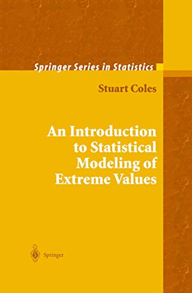
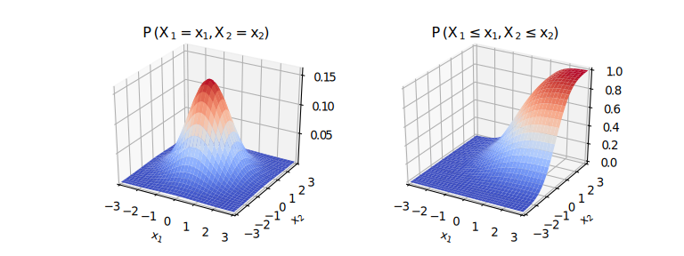
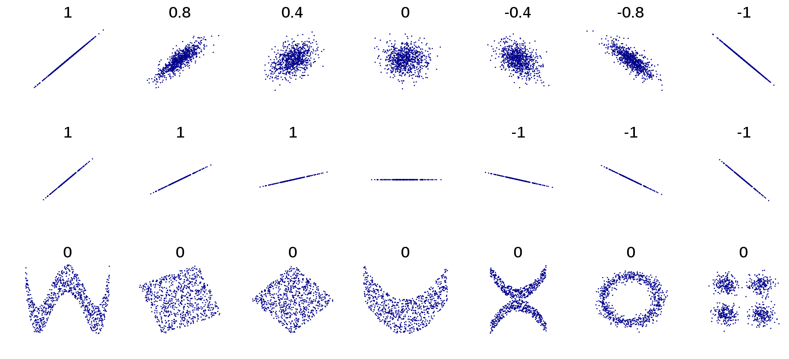
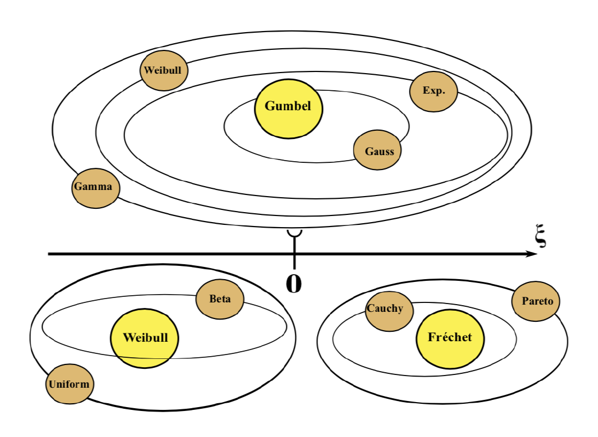
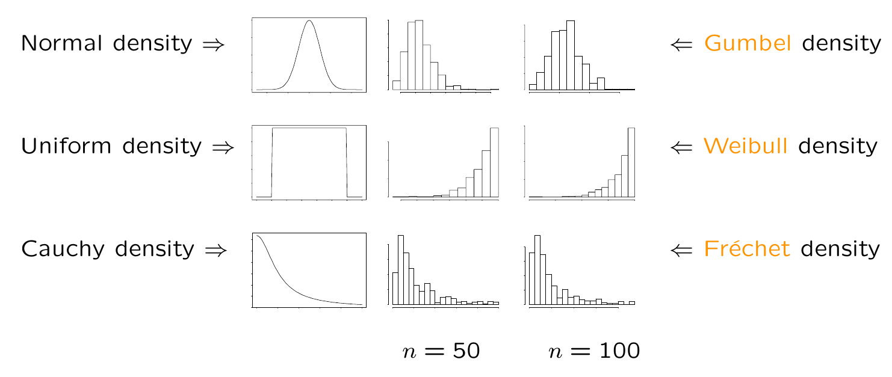

---
title: "Séance 3"
subtitle: "Bases de statistique l'étude des aléas climatiques"
author: "Soulivanh Thao <br/> sthao@lsce.ipsl.fr"
institute: "LSCE, ESTIMR"
date: "2020/10/01 (updated: `r Sys.Date()`)"
output:
  xaringan::moon_reader:
    lib_dir: libs
    nature:
      highlightStyle: github
      highlightLines: true
      countIncrementalSlides: false
---


# Séquence 2: Données et outils statistiques

- Séance 2: Pourquoi les statistiques pour étudier le climat? Avec quelles données ? + Séance pratique en R.

- Séance 3: Introduction aux notions statistiques de façon plus formelle

- Séance 4: Séances pratique en R sur les effets de l'aggrégation spatiale et l'effet de la variabilité interne sur les estimations statistiques.

- Séance 5: Introduction au downscaling statistique et correction de biais par la pratique.

Il y a beaucoup de pratique avec le logiciel R. Il vous faut donc l'installer ainsi que Rstudio.
Vous pouvez faire [ces exercices](https://github.com/thaos/MathDACC_tutoR/blob/master/Rtuto_basics/basics_tuto_exercices.R) pour vous familiariser avec R. La correction est disponible [ici](https://github.com/thaos/MathDACC_tutoR/blob/master/Rtuto_basics/basics_tuto.R.completed).

---
# Séance 2: sources et références

Cette séances reprend la trame et beaucoup d'éléments du chapite 2 de
<p align="center">
  
</p> 

L'autre grande partie du contenu provient simplement de Wikipedia.

Les autres sources sont cités au fur et à mesures des slides.

---
# Problèmes typiques

- Quelle température annuelle moyenne serons nous susceptible d'observer en 2051 ?
- Quelle est la probabilité que la température dépasse 290K en 1950 ? en 2050 ?
- Quelle est la probabilité que la température dépasse 320K en 1950 ? en 2050 ?
- Quelle seuil de température peut ont espérer dépasser au moins une fois tous les 50 ans ?

```{r, echo=FALSE, fig.height=3.5, dev='svg'}
tas_stagg <- readRDS(file = "../Ex2_aggregation/tas_stagg.rds")
tas <- readRDS(file = "../Ex2_aggregation/tas.rds")
dates <- dimnames(tas)[[3]]
years <- unique(as.integer(substring(dates, 1, 4)))

tas_smean_tmean <- tas_stagg[[1]][[1]]  

zones <- dimnames(tas_smean_tmean)[[2]]
periods <- dimnames(tas_smean_tmean)[[3]]
lon <- as.numeric(rownames(tas))
lat <- as.numeric(colnames(tas))

plot(
  years, tas_smean_tmean[, 1, 1], #* 3600 * 24 * 365,
  xlab = "year", ylab = "tas (K)", main = "tas, annual mean",
  pch = 20
  )
```

---
# Rappels sur les variables aléatoires continues


La distribution d'une variable aléatoire univariée et continue $X$ est entièrement déterminée par sa fonction de répartition (cumulative distribution function) 

$$F(x) = Pr (X \le x) $$
    
**Remarque** : on dit que $x_\alpha$ est le quantile de niveau $\alpha$ si $F(x_\alpha) = \alpha$
    
Si $F$ est une fonction continue, alors il existe une fonction positive $f$, appelé la densité de probabilité (probability density function) tel que

$$ Pr(a\le X\le b) = F(b) - F(a) = \int_a^b f(x)\,dx$$.


---
# cdf and pdf

```{r cdfpdf, echo=FALSE, fig.height=4, dev='svg'}
par(mfrow = c(1, 2))
x <- seq(-4, 4, by = 0.01)
plot(
  x, pnorm(x),
  main = "cdf", xlab = "x", ylab = "F(x)",
  type = "l", ylim = c(-0.1, 1)
)
abline(h = c(0, 1), lty = 2, col = "grey")
xstar <- -0.5
# xpol <- c(x[x < xstar], rep(xstar, 2))
# ypol <- c(pnorm(x[x < xstar]), pnorm(xstar), 0)
# polygon(xpol, ypol, col = "pink", border = NA)
# lines(x, pnorm(x))
segments(
  x0 = c(xstar, xstar),
  y0 = c(-1, pnorm(xstar)),
  x = c(xstar, -5),
  y = c(pnorm(xstar), pnorm(xstar)),
  lty = 2, col = "red"
)
text(
  x = c(-3.5, 0),
  y = c(0.35, -0.07),
  labels = c("F(a)", "a"),
  col = "red"
)

plot(
  x, dnorm(x),
  main = "pdf", xlab = "x", ylab = "f(x)",
  type = "l", ylim = c(-0.02, max(dnorm(x)))
)
abline(h = 0, lty = 2, col = "grey")
xstar <- -0.5
xpol <- c(-5, x[x < xstar], rep(xstar, 2))
ypol <- c(0, dnorm(x[x < xstar]), dnorm(xstar), 0)
polygon(xpol, ypol, col = "pink", border = NA)
lines(x, dnorm(x))
segments(
  x0 = xstar,
  y0 = -1,
  x = xstar,
  y = dnorm(xstar),
  lty = 2, col = "red"
)
text(
  x = c(-1.3, 0),
  y = c(0.02, -0.015),
  labels = c("F(a)", "a"),
  col = "red"
)
```

---
# Empirical estimator of the cdf

Soit $(X_1, ..., X_n)$ des variables aléatoires réelles, indépendantes et identiquement distribuées (i.i.d.) ayant pour cdf $F$. On définit la fonction de répartition empirique (empirical cumulative distribution function) par 

$$\widehat F_n(x) =  \frac{1}{n} \sum_{i=1}^n \mathbf{1}_{X_i \le x}$$

```{r ecdf, echo=FALSE, fig.height=4, dev='svg'}
par(mfrow = c(1, 2))
x <- seq(-4, 4, by = 0.01)
plot(
  x, pnorm(x),
  main = "cdf", xlab = "x", ylab = "F(x)",
  type = "l", ylim = c(-0.1, 1)
)
abline(h = c(0, 1), lty = 2, col = "grey")
xstar <- -0.5
# xpol <- c(x[x < xstar], rep(xstar, 2))
# ypol <- c(pnorm(x[x < xstar]), pnorm(xstar), 0)
# polygon(xpol, ypol, col = "pink", border = NA)
# lines(x, pnorm(x))
segments(
  x0 = c(xstar, xstar),
  y0 = c(-1, pnorm(xstar)),
  x = c(xstar, -5),
  y = c(pnorm(xstar), pnorm(xstar)),
  lty = 2, col = "red"
)
text(
  x = c(-3.5, 0),
  y = c(0.35, -0.07),
  labels = c("F(a)", "a"),
  col = "red"
)

xsample <- rnorm(20)
plot(
  ecdf(xsample),
  main = "cdf", xlab = "x", ylab = "F(x)",
  ylim = c(-0.1, 1), xlim = c(-4, 4)
)
segments(
  x0 = c(xstar, xstar),
  y0 = c(-1, ecdf(xsample)(xstar)),
  x = c(xstar, -5),
  y = c(ecdf(xsample)(xstar), ecdf(xsample)(xstar)),
  lty = 2, col = "red"
)
text(
  x = c(-3.5, 0),
  y = c(ecdf(xsample)(xstar) + 0.05, -0.07),
  labels = c("F(a)", "a"),
  col = "red"
)
```


---
# Esperance

#### Variable continue à densité

Si la variable aléatoire continue réelle $X$ admet une densité de probabilité $f$, son espérance est définie comme :
$$\mathbb{E}[X] = \int_{-\infty}^\infty x f(x)\, \mathrm{d}x$$
à condition que l'intégrale soit absolument convergente.

---
# Esperance (quelques propriétés)

#### Linéarité:
l'espérance est un opérateur linéaire. Pour deux variables aléatoires quelconques $X$ et $Y$  et pour deux nombres réels $a$ et $b$:
$$\mathbb E[aX+bY]=a\mathbb E(X)+b\mathbb E(Y)$$


#### Espérance d'une fonction d'une variable aléatoire:
Si $X$ est une variable aléatoire absolument continue réelle, de densité de probabilité $f$, alors l'espérance d'une fonction mesurable de $X$, $g(X)$ est:

$$\mathbb E \left[ g(X) \right] =  \int_{-\infty}^\infty g(x) f(x) \mathrm{d}x$$


---
# Estimateur empirique de l'esperance 

##### Théorème (Khintchine) : loi faible des grands nombres

Soit $X_n$ une suite de variables aléatoires réelles indépendantes et identiquement distribuées(i.i.d.) admettant une espérance $\mu = \mathbb{E}[X]$.

La moyenne empirique 
$$\overline{X}_n = \frac{1}{n}\sum_{k=1}^n X_k$$
converge en probabilité vers cette espérance : pour tout $\varepsilon > 0$, on a 
$$\lim_{n\to+\infty} \mathbb{P}\left(\left|\overline{X}_n-\mu\right| > \varepsilon\right) = 0$$ 

Ce résultat assure en particulier que la moyenne empirique est un estimateur convergent de l'espérance.

**Question** Calculer l'espérance de $\overline{X}_n$
---
# Variance


Dans le cas d’une variable aléatoire à densité, la variance est définie par :
$$\begin{align}
\operatorname{Var}(X) = \sigma^2  &= \mathbb{E}[(X-\mu)^2]\\
&  = \int_{-\infty}^\infty  (x-\mu)^2  f(x) \mathrm{d}x
\end{align}$$

où $f$ est la densité de probabilité de $X$ et $\mu$ l'espérance mathématique $X$ 


La variance d'une variable aléatoire continue $X$ peut aussi se calculer de la façon suivante :
$$  \operatorname{Var}(X) = \sigma^2 = \mathbb{E}[X^2] - \mu^2$$
Si $\sigma^2$ est la variance de $X$, $\sigma$ correspond à son écart-type.


---
# Variance (quelques propriétés)

##### Transformation affine
$$ \operatorname{Var}(aX+b) =  a^2\operatorname{Var}(X)$$
---
# Estimateur empirique de la variance
Soit $X_n$ une suite de variables aléatoires réelles indépendantes et identiquement distribuées(iid),  la variance $\sigma^2$ de cette loi peut être estimée à l’aide de la variance empirique

$$S_n^2 = \frac{1}{n}\sum_{i=1}^n(X_i-\overline{X})^2$$
où $\overline{X} = \frac{1}{n}\sum_{i=1}^n X_i$ est la [[moyenne empirique]].

Cet estimateur est cependant biaisé, car $\mathbb{E}(S_n^2) = \frac{n-1}{n}\sigma^2$.


---
# Période de retour

On considère un évènement de type dépassement de seuil

$$\{X_t > x\}$$
où $t$ dénote une année.

Soit la variable aléatoire $Y$ correspondant au nombre d'années entre deux évènements consécutifs.
La période de retour de l’évènement $\{X_t > x\}$ est défini comme 

$$ T(x) = \mathbb{E}[Y]$$


---
# Période de retour

Dans le cas où, les variables $X_t$ sont i.i.d, alors 
- pour tout $t$, $\mathbb{P}(X_t > x) = p_x$
- la variable $Y$ suit une loi géométrique de paramètre $p_x$:
$$ \mathbb{P}(Y = k) = (1-p_x)^{k-1} p_x$$

On déduit 
$$T(x) = \sum_{k = 1}^\infty k (1-p_x)^{k-1} p_x = \frac{1}{p_x}$$

Dans un cadre où les $X_t$ sont i.i.d., la durée de retour est l'inverse de la probabilité de l'évènement.

---
# Niveau de retour

Le niveau de retour $x_T$ associé à la période de retour $T$ est le seuil qui définie l’évènement $\{X_t > x_T\}$ qui revient en moyenne toutes les $T$ années.

On peut aussi voir $\{X_t > x_T\}$ comme l'événement qui apparaît en moyenne seulement une fois sur  $T$ années.

$$\mathbb{E}[\sum_{t=1}^{T} \mathbb{1}_{\{X_t > x_T\}}] = 1$$
---
# Niveau de retour

Dans le cas  où les $X_t$ sont identiquement distribuées,
$$\begin{align}
\mathbb{E}[\sum_{t=1}^{T} \mathbb{1}_{\{X_t > x_T\}}] = 1 &\Leftrightarrow T \mathbb{P}(X_1 > x_T) = 1 \\
&\Leftrightarrow \mathbb{P}(X_1 > x_T) = \frac{1}{T}
\end{align}$$

Autrement dit, $x_T$ est le quantile $1 -\frac{1}{T}$ de $X_t$.


---
# Loi jointe de 2 variables aléatoires continues

###Fonction de répartition bivariée
$$F_{XY}(x,y) = \mathbb{P}(X\leq x,Y\leq y)$$

<p align="center">

<br/>
<a href="http://motion.pratt.duke.edu/RoboticSystems/Probability.html">Source Kris Hauser</a>
</p>

**Remarque : ** $F_{XY}(x, +\infty) = F_{X}(x)$


---
# Loi jointe de 2 variables aléatoires continues

### Densité de probabilité bivariée
$$f_{XY}(x,y) = \frac{\partial^2}{\partial x\,\partial y}F_{XY}(x,y)$$
<p align="center">

<br/>
<a href="http://motion.pratt.duke.edu/RoboticSystems/Probability.html">Source Kris Hauser</a>
</p>

**Remarque :**   $f_X (x) = \int_{-\infty}^\infty f_{XY}(x,y)\,\mathrm dy$

<!--   $f_{X|Y}(x, y) = \frac {f_{XY}(x,y)} {f_{Y}(y)}$ --> 

---
# Dépendence et indépendance

#### Pour deux événements

Deux événements $A$ et $B$ sont indépendants (parfois noté $A \perp B$ or $A \perp\!\!\!\perp B$) si et seulement si 
$$\mathrm{P}(A \cap B) = \mathrm{P}(A)\mathrm{P}(B)$$


---
# Dépendence et indépendance

#### Deux variable aléatoires réelles

$X$ and $Y$ sont indépendantes si et seulement si leur fonction de répartition jointe  $F_{X,Y}(x,y) = P(X \leq x, Y \leq y)$ peut s'écrire comme 
$$ F_{X,Y}(x,y) = F_X(x) F_Y(y) \quad \text{pour tout } x,y.$$
<br /> 

De manière équivalente, si les densités de probabilité  $f_X(x)$ et  $f_Y(y)$ ainsi que la densité de probabilité jointe $f_{X,Y}(x,y)$ existent,

$$ f_{X,Y}(x,y) = f_X(x) f_Y(y) \quad \text{pour tout } x,y.$$
---
# Indépendance et probabilité conditionnelle 

Si $\mathbb{P}(B) \neq 0$,  la probabilité conditionnelle de l'événement $A$ sachant l'événement $B$, notée $\mathbb{P}(A\mid B)$ est définie par la relation ci-dessous :

$$ \mathbb{P}(A\mid B)={\mathbb{P}(A \cap B) \over \mathbb{P}(B)} = \dfrac{P(B \mid A)P(A)}{P(B)}$$
C'est le théorème de Bayes!

<br /> 

Dans le cas où les évenements sont indépendants, 
$$\mathrm{P}(A \cap B) = \mathrm{P}(A)\mathrm{P}(B) \iff \mathrm{P}(A\mid B) = \frac{\mathrm{P}(A \cap B)}{\mathrm{P}(B)} = \mathrm{P}(A).$$

La probabilité $\mathrm{P}(A\mid B)$ ne dépend donc pas de $B$.

---
# Indépendance et densité conditionnelle 

Pour deux variables aléatoire réelles $X$  and $Y$,  le théorème de Bayes s'applique également aux densités conditionelles:

$$f_{X \mid  Y=y} (x) = \frac{f_{X,Y}(x,y)}{f_Y(y)} = \frac{f_{Y \mid  X=x}(y) f_X(x)}{f_Y(y)}.$$
<br /> 

$X$ et $Y$ sont indépendantes si et seulement si  

$$f_{X \mid  Y=y} (x) = f_{X} (x) \quad \text{pour tout } x,y.$$


---
# Covariance

La covariance de deux variables aléatoires réelles $X$ et $Y$ ayant chacune une variance finie est définie par
$$ \operatorname{Cov}(X,Y) = \mathbb{E}[(X-\mathbb{E}[X])\,(Y-\mathbb{E}[Y])$$
<br /> 

De manière équivalente :
$$ \operatorname{Cov}(X,Y) = \mathbb{E}(XY) - \mathbb{E}(X) \mathbb{E}(Y)$$


**Question :** Comment estimer  $\operatorname{Cov}(X,Y)$ ?


---
# Covariance

- La variance de $X$ est donc $\operatorname{Var}(X) = \operatorname{Cov}(X, X)$.

-  Covariance d'une combinaison linéaire
$$\begin{align}
\operatorname{cov}(aX+bY, cW+dV) &= ac\,\operatorname{cov}(X,W)+ad\,\operatorname{cov}(X,V)\\
&+bc\,\operatorname{cov}(Y,W)+bd\,\operatorname{cov}(Y,V)
\end{align}$$
où $X$, $Y$, $W$  et $V$ sont des variables aléatoires réelles et $a$, $b$, $c$ et  $d$ sont des constantes rée    lles.


**Question : ** Calculer la variance de $$\overline{X}_n = \frac{1}{n}\sum_{k=1}^n X_k$$ si les $X_i$ sont i.i.d.
---
# Correlation (de Pearson)

Le coefficient de corrélation entre deux variables aléatoires réelles $X$ et $Y$ ayant chacune une variance finie, noté $\operatorname{Cor}(X,Y)$, ou parfois $\rho_{XY}$, ou simplement $r$,  est défini par :
$$ r = \frac{\operatorname{Cov}(X,Y)}{\sigma_X \sigma_Y}$$
où $\sigma_X$ et $\sigma_Y$ désignent respectivement les écarts types de $X$ et $Y$.

<br /> 
**Question: ** Comment estimer  $\operatorname{Cor}(X,Y)$ ?


---
# Independance et correlation
La valeur du coefficient de corrélation est comprise entre  −1 et  +1.

Elle indique le degré de dépendance linéaire entre deux variable :

- 1 correspond à une parfaite relation linéaire croissante

- -1 correspond à une parfaite relation inverse décroissante. 

- 0 indique une absence de relation linéaire entre les variables.


**Attention !**

$$ 
\begin{align}
X,Y \text{ independent} \quad & \Rightarrow \quad \rho_{X,Y} = 0 \quad (X,Y \text{ uncorrelated})\\
\rho_{X,Y} = 0 \quad (X,Y \text{ uncorrelated})\quad & \nRightarrow \quad X,Y \text{ independent}
\end{align}
$$
---
# Exemples de corrélation

---
# Vraisemblance

Soit $X$ une variable aléatoire (potentiellement multivarié) ayant pour densité de probabilité $f$ dépendant d'un paramètre $\theta$. 

<br /> 

La vraisemblance $\mathcal L$ est une fonction de $\theta$, étant donnée une réalisation $x$ de la variable aléatoire $X$:

$$\mathcal L(\theta | x) = f(x; \theta)$$
---
# Vraisemblance (exemple)

Soit $X_1, ..., X_n$ des variables aléatoires i.i.d. de loi exponentielle

$$f_{X_1}(x; \theta) = \left\{\begin{matrix}
\theta e^{-\theta x} & \text{si} \; x \geqslant 0 \\
0 & \text{si} \; x < 0
\end{matrix}\right.$$

<br /> 

On observe $x_1, ..., x_n$ les réalisations respectives de $X_1, ..., X_n$

<br /> 

La vraisemblance de $x_1, ..., x_n$ s'écrit

$$\begin{align}
  \mathcal L(\theta | x_1, ..., x_n) &= f_{X_1}(x_1; \theta) \times \ldots \times f_{X_n}(x_n; \theta) \\
  &= \theta^n e^{-\theta (x_1 + \ldots + x_n)}
\end{align}$$

**Question.** Quelle est la fonction de répartition de la loi exponentielle ?

---
# Estimation par maximum de vraisemblance

On cherche $\hat\theta$ qui maximise la vraisemblance des données observées $\textbf x = (x_1, \ldots, x_n)$:

$$\hat\theta = \underset{\theta}{\mathrm{argmax}} \, \mathcal L(\theta |\textbf x)$$

**Remarque**: maximiser  $\mathcal L(\theta |\textbf x)$ revient à maximiser  $\mathcal{l}(\theta | \textbf{x}) = \log  L(\theta |\textbf{x})$

---
# Exemple avec lois exponentielles i.i.d.

$$\begin{align} 
\underset{\theta}{\mathrm{argmax}} \, \mathcal L(\theta |\textbf x) &= \underset{\theta}{\mathrm{argmax}} \, \theta^n e^{-\theta (x_1 + \ldots + x_n)} \\
&= \underset{\theta}{\mathrm{argmax}} \, \mathcal{l}(\theta |\textbf x) \\
&= \underset{\theta}{\mathrm{argmax}} \log(\exp(n \log(\theta) -\theta (x_1 + \ldots + x_n)) \\
&= \underset{\theta}{\mathrm{argmax}} \, n \log(\theta) -\theta (x_1 + \ldots + x_n)
\end{align}$$

$$\begin{align} 
\frac{\mathrm d \mathcal l(\theta |\textbf x)}{\mathrm d \theta} = 0 &\implies \frac{n}{\theta} - (x_1 + \ldots + x_n) = 0 \\
&\implies \theta = \frac{n}{(x_1 + \ldots + x_n)}
\end{align}$$
---

# Estimateurs du maximum de vraisemblance

### Propriétés


L'estimateur obtenu par la méthode du maximum de vraisemblance est :

* convergent,
* asymptotiquement efficace, il atteint la borne de Cramér-Rao,
* asymptotiquement distribué selon une loi normale.

En revanche, il peut être biaisé en échantillon fini.


---
# Convergence en loi et  fonction de répartition

Considérons:

- une suite $X_1$, $X_2$,  ..., $X_n$, de variables aléatoires réelles ayant respectivement pour fonction de répartition  $F_1$, $F_2$, ..., $F_n$ 

- et une autre variable aléatoire réelle $X$ de fonction de répartition $F$

On dit que $(X_n)_{n\ge 0}$ converge en loi vers $X$ si et seulement si 

$$\lim_{n \rightarrow \infty}\ F_n(x) = F(x)$$

dès que  la fonction de répartition $F$ de $X$ est continue en $x$, ou bien, de manière équivalente, dès que $\mathbb P(X=x)=0$ 

**Remarque**.  Quand on utilise par exemple  la convergence en loi, on parle de théorie asymptotique.

---
# Egalité en distribution

Deux variables aléatoires réelles X et Y sont égale en distribution si et seulement si elles ont la même fonction de répartition :
    
$$X \stackrel{d}{=} Y \Leftrightarrow \operatorname{P}(X \le x) = \operatorname{P}(Y \le x)\quad\text{for all }x$$
Pour comparer deux échantillons, on peut se baser sur les diagnostiques graphiques suivants :

```{r qqplot, echo=FALSE, fig.height=3, dev='svg'}
par(mfrow = c(1, 3))


xsample <- rnorm(20)
xsample2 <- rnorm(20, mean = 0.05, sd = 0.99)
xylim <- range(xsample, xsample2) + c(-0.3, 0.3)

plot(
  ecdf(xsample),
  main = "pdf", xlab = "x", ylab = "F(x)",
  xlim = xylim
)
lines(
  ecdf(xsample2), col = "brown"
)
legend(
  "bottomright", legend = c(expression('X'[1]), ylab = expression('X'[2])),
  pch = 20, col = c("black", "brown")
)
qqplot(
  xsample, xsample2,
  xlab = expression('X'[1]), ylab = expression('X'[2]),
  xlim = xylim, ylim = xylim,
  pch = 20, main = "qq-plot", asp = 1
)
abline(a = 0, b = 1, col = "red")
xmerged <- sort(c(xsample, xsample2))
xmerged <- xmerged[seq(1, length(xmerged), 1)]
# xmerged <- seq(min(xmerged), max(xmerged), length.out = 20)

plot(
  ecdf(xsample)(xmerged),
  ecdf(xsample2)(xmerged),
  xlab = expression('F'[X[1]]*'(x)'), ylab = expression('F'[X[2]]*'(x)'),
  xlim = c(0, 1), ylim = c(0, 1),
  pch = 20, main = "pp-plot", asp = 1
)
abline(a = 0, b = 1, col = "red")
```


---
# Intervalle de confiance


Soit $(X_1, . . . , X_n)$ un n-échantillon aléatoire et $\theta$ un paramètre inconnu de
la loi des $X_i$.

Soit $\alpha \in ]0, 1[$. S’il existe des v.a.r. $θ_{min}(X_1, . . . , Xn)$ et
$θ_{max}(X_1, . . . , X_n)$ telles que 

$$\mathbb{P} (\theta \in [\theta_{min}(X_1, . . . , X_n), \theta_{max}(X_1, . . . , X_n)]) = 1 − \alpha,$$

on dit alors que 

$$[\theta_{min}(X_1, . . . , X_n), \theta_{max}(X_1, . . . , X_n)]$$
est un intervalle de confiance pour $\theta$, avec un niveau de confiance de $1 − \alpha$. On le note $IC_{1−\alpha}(\theta)$.


**Remarque.** Un interval de confiance est une variable aléatoire.

.footnote[
source [wikistat](https://www.math.univ-toulouse.fr/~besse/Wikistat/pdf/st-l-inf-estim.pdf).
]

---
# Intervalle de confiance pour l'espérance d'une loi normale

Soit $(X1, . . . , Xn)$ un n-échantillon i.i.d.  de variables aléatoires réelles de loi $\mathcal N(\mu, \sigma^2)$.
On suppose la variance $\sigma_2$ connue et $\mu$ est estimé par la moyenne empirique

$$\overline{X}_n = \frac{1}{n}\sum_{i=1}^n X_i \sim  \mathcal N(\mu, n \sigma^2)$$

Il en résulte que

$$\sqrt{n} \left(\frac{\overline{X}_n  − \mu}{\sigma}\right) \sim \mathcal N(0, 1)$$

---
# Quelques propriétés de la loi normale

#### Stabilité par linéarité

Soit $a \geq 0$, $b$ deux réels et $X\sim\mathcal N(\mu,\sigma^2)$ alors 

$$aX + b \sim \mathcal N(\alpha \mu + \beta, \alpha^2 \sigma^2).$$

#### Stabilité par additivité 

Soit $X_1\sim \mathcal N(\mu_1,\sigma_1^2)$, $X_2\sim \mathcal N(\mu_2,\sigma_2^2)$ et $X_1$ et $X_2$ sont indépendantes, alors 

$$X_1+X_2 \sim \mathcal N(\mu_1 + \mu_2, \sigma_1^2 + \sigma_2^2).$$
---
# Intervalle de confiance pour l'espérance d'une loi normale (suite)

$$\sqrt{n} \left(\frac{\overline{X}_n  − \mu}{\sigma}\right) \sim \mathcal N(0, 1)$$

donc, 

$$\mathbb{P}\left(−z_{1−\alpha/2} \leq \sqrt{n} \left(\frac{\overline{X}_n  − \mu}{\sigma}\right) \leq z_{1−\alpha/2}\right) = 1 − \alpha$$
Ceci équivaut à

$$\mathbb{P}\left(\overline{X}_n −z_{1−\alpha/2} \frac{\sigma}{\sqrt{n}} \leq  \mu \leq \overline{X}_n + z_{1−\alpha/2}\right) = 1 − \alpha$$
où $z_{1−\alpha/2}$ est le quantile ${1−\alpha/2}$ de la loi normale centrée réduite  $\mathcal N(0, 1)$


---
# Intervalle de confiance pour l'espérance d'une loi normale (suite)

$$\mathbb{P}\left(\overline{X}_n −z_{1−\alpha/2} \frac{\sigma}{\sqrt{n}} \leq  \mu \leq \overline{X}_n + z_{1−\alpha/2}\right) = 1 − \alpha$$

Ainsi quand $\sigma^2$ est connue,
$$IC_{1−\alpha}(\mu) = \left[\overline{X}_n − z_{1−\alpha/2} \frac{\sigma}{\sqrt{n}}, \overline{X}_n + z_{1−\alpha/2} \frac{\sigma}{\sqrt{n}} \right]$$
---
# Théorème Central Limite.

Si $X_1,X_2,\ldots,X_n$ sont des variables aléatoires réelles indépendantes de même loi de probabilité, d'espérance $\mu$ et de variance $\sigma^2$ alors, lorsque $n$ est suffisamment grand :

la variable aléatoire :
$$ S_n = X_1+X_2+\ldots+X_n$$
suit approximativement une loi normale d'espérance $\mu n$ et d'écart-type $\sigma\sqrt n$, notée :
$$\mathcal N(\mu n,\sigma\sqrt n)$$
.footnote[
source : [wikiversity](https://fr.wikiversity.org/wiki/Th%C3%A9or%C3%A8me_central_limite)
]

---
# CLT: exercice

Dans le logiciel  R, 

1. Simuler un échantillon de n=30 variables uniformes sur [0, 1].

2. Calculer la moyenne de cette échantillon.

3. Répeter la même opération B=300 fois pour avoir un échantillon de B moyennes.

4. Cette échantillon de B moyennes vous parait-il suivre une loi normal ?

5. Que se passe-t'il si on augmente n ?
---
# Intervalle de confiance asymptotique de l'espérance

Soit $(X_1, . . . , X_n)$ un n-échantillon de variables aléatoires réelles i.i.d.

Si
- les Xi admettent une espérance $\mu$ et une variance $\sigma^2$ > 0 ,
- on dispose d’un estimateur $S_n$ convergent de $\sigma$. C'est par exemple le cas pour $S_n = \sqrt {\frac{1}{n}\sum_{i=1}^n(X_i-\overline{X})^2}$,

alors un intervalle de confiance asymptotique de $\mu$ au niveau de confiance $1 − \alpha$ est :

$$IC_{1−\alpha}(\mu) = \left[\overline{X}_n − z_{1−\alpha/2} \frac{S_n}{\sqrt{n}}, \overline{X}_n + z_{1−\alpha/2} \frac{S_n}{\sqrt{n}} \right]$$
.footnote[
source : [Mathieu Mansuy](http://www.mathieu-mansuy.fr/pdf/ECS2-Chapitre21.pdf)
]


---
# Loi d' extremum généralisée

Generalized Extreme Value distribution (GEV)
					
$$M_n = max\{X_1 , ... , X_n\},$$
où $X_l, ... , X_n$, est une séquence de variables aléatoires indépendantes et de fonction de répartition $F$.

**Theorem**
					
Si il existe  une séquence de constantes $\{a_n > 0\}$ et  $\{b_n\}$ tel que
$$\mathbb{P}\{(M_n - b_n)/a_n \leq z \} \rightarrow G(z) \text{ as } n \rightarrow \infty $$  

où  $G$ une fonction de répartition non-dégénérée, alors $G$ appartient à famille des distributions GEV

$$G(z) = \exp\left\{-\left[1 + \xi \left(\frac{z - \mu}{\sigma}\right)\right]^{-1/\xi}\right\},$$

définie sur $\{z : 1 + \xi (z - \mu) / \sigma \geq 0\}$, avec $-\infty < \mu < \infty$, $\sigma > 0$ et 	$-\infty < \xi < \infty$

---
# Loi d' extremum généralisée

**En pratique**, on ne cherche pas les constantes de normalisation  $\{a_n > 0\}$ et  $\{b_n\}$. On regarde simplement si les données sont cohérents avec une distribution GEV.


On utilise le fait que sous les hypothèse du théorème
$$\mathbb{P}\{M_n \leq z \} \approx G\{ (z - b_n)/a_n \} = G^*(z),$$
où $G^*$ est un autre membre de la familee des GEV.

**Question :** Déterminer le quantile de niveau $1-p$ d'une loi GEV de paramètres ( $\mu$,  $\sigma$, $\xi$ ).

---
# Domaines d'attraction



---
# Domaines d'attraction et convergence

---
# Block maxima
```{r blockmax, echo=FALSE, fig.height=3, dev='svg'}
  x = rnorm(100)
  block = rep(1:10, rep(10, 10))
  imax = tapply(x, block, function(x) x == max(x)) |> unlist()
  thresh = quantile(x, p = 0.9)
  iabove = x >= thresh
  col = c("grey", "red")
  par(mar = c(2, 3, 0, 1))
  plot(x, type = "n", xlab = "", ylab = "", cex.axis  = 2)
  points(x, col = col[imax+1], cex = 3, pch = 20)
  abline(v = 0.5 + 1:10 * 10, lty = 4, lwd = 3)
```

---
# Block maxima : exercice

Dans le logiciel  R, 

1. Simuler un échantillon de n=30 variables exponentielles

2. Calculer le maxmimum de cette échantillon.

3. Répeter la même opération B=300 fois pour avoir un échantillon de B maxima.

4. Cette échantillon de B moyennes vous parait-il suivre une loi GEV ?

5. Que se passe-t'il si on augmente n ?

---
# Loi de pareto genéralisée

Generalized Pareto Distribution (GPD)

$$(X - u) | (X > u) $$

where X has a distribution function $F$

**Theorem**
Si lorsque  $n \rightarrow \infty$, $M_n = max\{X_1 , ... , X_n\}$ converge en distribution vers $G$ appartenant à la famille GEV, alors pour $u$ assez grand,  la fonction de répartition de  $(X - u) | (X > u) $  peut être approximée par 

$$H(y) = 1 - \left(1 + \frac{\xi y}{\tilde{\sigma}} \right)^{-1/\xi}$$

définie sur $\{y : y > 0$ avec $(\xi y / \tilde{\sigma}) > 0 \}$


---
# Loi de pareto genéralisée

 **Remark**.  On a une correspondance avec les paramétrés da la distribution GEV
 
 - $\tilde{\sigma} =  \sigma + \xi (u - \mu)$  
 
 - le paramètre de forme est le même que celui de la GEV associée.
 
 - le paramètre de forme  $\xi$, aussi appelé 'indice des valeurs extrêmes' charcterise le comportement de la queue de distribution: 
    - $\xi < 0$, la  distribution a une borne supérieure égale à $\mu - \tilde{\sigma} / \xi$ 
    - $\xi = 0$, la distribution a une queue à décroissance exponentielle. On interprète ce cas comme la limite de $\lim_{\xi \rightarrow 0} H(y)$
    - $\xi > 0$, la distribution est à queue lourde. 
    
**Question :** Déterminer le quantile de niveau $1-p$ d'une loi GPD de paramètres ( $\sigma$, $\xi$ )

---
# Peaks over threshold
```{r pot, echo=FALSE, fig.height=3, dev='svg'}
  par(mar = c(2, 3, 0, 1))
  plot(x, type = "n", xlab = "", ylab = "", cex.axis= 2)
  abline(h = thresh, lty = 4, lwd = 3)
  for(i in seq_along(x)){
    if(iabove[i]) segments(i, x[i],  i, thresh, lwd = 4)
  }
  points(x, col = col[iabove+1], cex = 3, pch = 20)
```

---
# Peaks over threshold: Exercice

Dans le logiciel  R, 

1. Simuler un échantillon de n=30 000 variables gaussiennes centrées réduites

2. Garder seulement les réalisations supérieures à u = 1.

3. Ces dernières paraissent elle venir d'une loi GDP ?

4. Refaire le même exercice avec u = 2


---
# Hypothèse i.i.d. non vérifiée ?

1. Il n'y pas indépendance entre les différents pas de temps 

  $\rightarrow$ cas non-traité dans ce cours.

2. La distribution évolue au file du temps (processus non-stationnaires)
  - saisonnalité (hiver, printemps, été, automne)
  - tendance, e.g., changement climatique.
  
Pour la non-stationnarité, une solution est de travaillé sur des sous-période que l'on peut considérer comme stationnaires.

Ou, on peut essayer d'intégrer la non-stationnarité dans la modélisation.
---
# Covariables dans les parametres

On suppose les v.a.r. $Y_t, t=  1,\ldots, T$, indépendantes et appartenant à la même famille de loi avec des paramètres différents.

<br /> 


Prenons par exemple:

$$ Y_t \sim \mathcal N(\mu_t,\sigma^2)$$
avec $\mu_t = \alpha + \beta x_t$.

<br /> 


Par exemple, $Y_t$ peut être la température moyenne globale à l'année $t$ et $x_t$ est la concentration de gaz à effet de serre à l'année $t$. On fait ici l'hypothèse que $\mu_t$ est une fonction affine de $x_t$.

---
# Estimation par maximum de vraisemlance

On suppose $x_t$ et $\sigma^2$ connus. On cherche à estimer les paramètres $a$ et $b$.
On procède par maximum de vraisemblance.

<br /> 

La log-vraisemblance de $(y_1, ..., y_T)$ s'écrit

$$\begin{align}
\mathcal l(\alpha,  \beta| y_1, ..., y_T) &= \log f_{Y_1}(y_1; \alpha, \beta) + \ldots + \log f_{Y_n}(y_n; \alpha, \beta) \\
&= \sum_{t = 1}^{T} \log \left(\frac{1}{\sigma\sqrt{2\pi}} \exp\left(-\frac{\left(y_t - \alpha - \beta x_t$ \right)^2}{2\sigma^2} \right)\right)\\
&=  -n\log \left(\sigma\sqrt{2\pi}\right) - \sum_{t = 1}^{T} \frac{\left(y_t - \alpha - \beta x_t$ \right)^2}{2\sigma^2}
\end{align}$$

---
# Lien avec la régression linéaire

Maximiser la log-vraisemblance par rapport à $\alpha$ et $\beta$ revient à minimiser  la somme des écarts au carré: 
$$\sum_{t = 1}^{T} \left(y_t - \alpha - \beta x_t \right)^2$$


C'est le même problème que la régression linéaire simple par moindre carrée ordinaire.

<!--  
On effet, 
$$ Y_t \sim \mathcal N(\mu_t,\sigma^2) \Leftrightarrow Y_t = \alpha + \beta x_t + \varepsilon_t$$

où les $\varepsilon_t$ sont des $\mathcal N(0, 1)$ indépendantes. -->

On trouve alors:

- $\widehat\alpha = \bar{y} - (  \widehat\beta\,\bar{x})$
- $\widehat\beta =  \frac{ s_{x, y} }{ s^2_{x} }$

avec $\bar x$ et $\bar y$, les moyennes respectives des $x_t$ et des $y_t$, $s^2_x$ la variance empirique des $x_t$ et $s_{x, y}$, la covariance empirique des couples $(x_t, y_t)$.

---
# Vérifier l'ajustement des modèles avec covariables

#### Modèle gaussien

Si $Y_t \sim \mathcal N(\hat\mu_t,\hat\sigma_t^2)$ alors 
$$\tilde{Y_t} = \frac{Y_t - \hat\mu_t}{\hat\sigma_t} \sim \mathcal N(0, 1)$$
On peut vérifier graphiquement avec un qq-plot que les $\tilde{Y_t}$ paraissent suivre une loi normale centrée réduite.

---
# Vérifier l'ajustement des modèles avec covariables

#### Modèle GEV

Si $Y_t \sim \mathcal GEV(\hat\mu_t,\hat\sigma_t, \hat\xi_t)$ alors 
$$\tilde{Y_t} = \frac{1}{\hat\xi_t} \log \left\{1 +  \hat\xi_t  \left(\frac{Y_t - \hat\mu_t}{\hat\sigma_t} \right) \right\} \sim \mathrm {Gumbel}(0, 1)$$
avec $\mathbb P(\tilde{Y_t} < y) = \exp(-e^{-y})$
#### Modèle GPD


Si $Y_t \sim \mathcal GPD(\hat\sigma_t, \hat\xi_t)$ alors 
$$\tilde{Y_t} = \frac{1}{\hat\xi_t} \log \left\{1 +  \hat\xi_t  \left(\frac{Y_t - \hat u_t}{\hat\sigma_t} \right) \right\} \sim \mathrm{Exp}(1)$$
avec $\mathbb P(\tilde{Y_t} < y) = 1 - \exp(-y)$


---
# Pouvez maintenant traiter ces questions ?

- Quelle température annuelle moyenne serons nous susceptible d'observer en 2051 ?
- Quelle est la probabilité que la température dépasse 290K en 1950 ? en 2050 ?
- Quelle est la probabilité que la température dépasse 320K en 1950 ? en 2050 ?
- Quelle seuil de température peut ont espérer dépasser au moins une fois tous les 50 ans ?

```{r, echo=FALSE, fig.height=3.5, dev='svg'}
tas_stagg <- readRDS(file = "../Ex2_aggregation/tas_stagg.rds")
tas <- readRDS(file = "../Ex2_aggregation/tas.rds")
dates <- dimnames(tas)[[3]]
years <- unique(as.integer(substring(dates, 1, 4)))

tas_smean_tmean <- tas_stagg[[1]][[1]]  

zones <- dimnames(tas_smean_tmean)[[2]]
periods <- dimnames(tas_smean_tmean)[[3]]
lon <- as.numeric(rownames(tas))
lat <- as.numeric(colnames(tas))

plot(
  years, tas_smean_tmean[, 1, 1], #* 3600 * 24 * 365,
  xlab = "year", ylab = "tas (K)", main = "tas, annual mean",
  pch = 20
  )
```

---
# Quelques précautions

> "All models are wrong, but some are useful." - George Box (1976)

Les modèles ne sont que des approximations. 

En particulier,  

- On simplifie souvent le probème pour faciliter la modélisation : .e.g. hyothèse d'indépendance.

- On se base sur des propriétés asymptotiques: attention à la vitesse de convergence.

- Attention à l'extrapolation des ajustements des modèles avec covariables: ce n'est pas parce qu'on observe une tendance (linéaire) qu'elle se poursuivra dans le futur.

Donc, il faut expliciter clairement les hypothèses du modèle utilisé et les prendre en compte pour l'interprétation des résultats.
---
# Estimateurs: bias, variance, mse

---
# diagnostiques des modèles

---


<!--
---
 
# Théorème de la valeur extrême.

Soit $X_1,X_2\ldots, X_n\ldots$ une séquence de variables indépendantes et identiquement distribuées et $M_n=\max\{X_1,\ldots,X_n\}$. Si une séquence de paires de nombres réels $(a_n, b_n)$ existe telle que $a_n>0$ et
$$\lim_{n \to \infty}P\left(\frac{M_n-b_n}{a_n}\leq x\right) = F(x)$$,
où $F$ est une fonction de distribution non dégénérée, alors la distribution limite $F$ appartient à la famille des lois de Gumbel, lois de Fréchet, ou des lois de Weibull. Ces familles peuvent être regroupées dans la classe des lois d'extremum généralisées de fonction de répartition:

$$F(x;\mu,\sigma,\xi) = \exp\left\{-\left[1+\xi\left(\frac{x-\mu}{\sigma}\right)\right]_+^{-1/\xi}\right\}$$

avec
$\left(1+\xi(x-\mu)/\sigma \right)_+=\max\left( 0 , 1+\xi(x-\mu)/\sigma \right)$
où $\mu\in\mathbb{R}$ est un paramètre de position, $\sigma > 0$ un paramètre de dispersion et $\xi\in\mathbb{R}$ un paramètre de forme appelé ''indice des valeurs extrêmes''.

.footnote[
source : [wikipedia](https://fr.wikipedia.org/wiki/Th%C3%A9or%C3%A8me_de_Fisher-Tippett-Gnedenko)
]
-->
