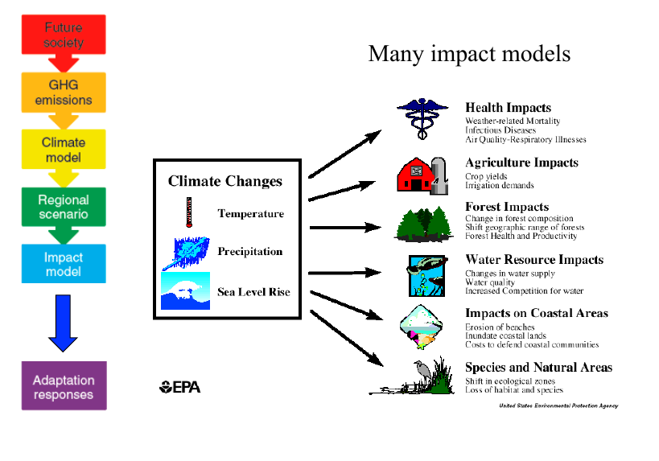

# Downscaling

[IPCC, 2013: Annex III: Glossary](https://www.ipcc.ch/site/assets/uploads/2018/02/WG1AR5_AnnexIII_FINAL.pdf)

> Downscaling is a method that derives local to regional scale (10 to 100 km) information from larger-scale models or data analyses. 

> Two main methods exist: dynamical downscaling and empirical/statistical downscaling. 

> The dynamical method uses the output of regional climate models, global models with variable spatial resolution or high-resolution global models. 

> The empirical/statistical methods develop statistical relationships that link the large-scale atmospheric variables with local/regional climate variables. 

> In all cases, the quality of the driving model remains an important limitation on the quality of the downscaled information.

---

# Downscaling

---
# Correction de biais

**Biais (statistiques)** :  Soit $T$ un estimateur d'un parametre $\theta$. Le bias de l'estimateur $T$ est défini par 
$$\mathbb{E}[T - \theta] = \mathbb{E}[T] - \theta$$

[Maraun (2016)](https://doi.org/10.1007/s40641-016-0050-x)

> Transferring the bias concepts from statistics and forecast verification to a climate modelling context,

> a climate model bias can be defined as the systematic difference between a simulated climate statistic and the corresponding real-world climate statistic. 

> A model bias derived from model and observational data is —as the statistics it is calculated from— only an estimate of the true model bias and therefore also affected by internal climate variability.

**Remarque** : le downscaling statistique peut être vu comme une forme de correction de bias où le bias est généré par la différence de résolution. 

---
# Pour l'étude des impacts



---


# Downscaling statistique et correction de bias

**Objectif** trouver une relation statistique entre $X$, la variable à downscaller/corriger  et $Y$, la variable de référence.

<br/>

Deux familles de méthode:

- Perfect Prognosis : on travaille sur  les réalisations $x$ et $y$ des variables $X$ et $Y$,

- Model Output Statistics : on travaille sur loi de probabilité des variables $X$ et $Y$

---

# Perfect Prognosis

Trouver comment transformer une réalisation $x_i$ en une réalisation $y_i$.

Un exemple de modèle classique

$$ Y = f(X) + \epsilon $$
- approche par fonction de transfert / régression, on cherche à modéliser
$$ \mathbb{E}[Y | X = x] =  f(x)$$

- approche par générateur de temps stochastique, on cherche à modéliser la variable aléatoire
$$ (Y | X = x) =  f(x) + \epsilon $$
en essayant d'estimer la fontion $f$ et de modéliser la distribution du bruit $\epsilon$.


Les predicteurs sont supposés parfaits.

On a besoin de l'appariement temporelles entre les variables $X_i$ et $Y_i$.

---


# Régression linéaire simple

Soit $Y$ la variable locale que l'on cherche à prédire à partir de $X$, la variable à large échelle. 

On modélise $Y$ par régression linéaire

$$Y_i = a X_i + b + \epsilon_i$$
avec

- $a$ et $b$, les coefficents de la régression linéaire à estimer.
- $\epsilon$, un bruit que l'on suppose souvent gaussien.

On cherche les coefficients $\hat{a}$ et $\hat{b}$ qui minimisent la fonction de coût

$$C(a, b) =  \sum_i (Y_i - a X_i + b)^2$$
Pour une valeur $X_{new}$, la prédiction pour la valeur de $Y_{new}$ correspondante est donnée par 
$$\hat{Y}_{new} = \hat{a} X_{new} + \hat{b}$$

---
# Exemple synthetique

```{r, echo=FALSE, fig.height=4, dev='svg'}
n <- 20
X <- rnorm(n, 0, 3)
Y <- 1.5 * X - 2 +  rnorm(n, 0, 4)
fit <- lm(Y ~ X)
Yhat <- predict(fit)
par(mar = c(4, 4, 1, .1))
plot(X, Y, pch = 19, col = 'gray', las = 1, main = "régression linéaire")
abline(a = coef(fit)[1], b = coef(fit)[2])
for (i in seq_along(X)){
  segments(X[i], Y[i], X[i], Yhat[i], col = "red", lty = 2)
}
points(X, Y, pch = 19, col = 'gray', las = 1)

```

---
# Régression par plus proche voisin
En anglais, k-nearest-neighbour regression avec $k = 1$.

On définit la base d'apprentissage comme l'ensemble des couples $(X_i, Y_i)$ observés.
Pour une valeur $X_{new}$, la prédiction pour la valeur de $Y$ correspondante est donnée par 
$$\hat{Y}_{new} = Y_{i^*}$$
avec $$i^* = \underset{i}{\arg\min} \quad d(X_i, X_{new})$$

où $d$ désigne une distance.

---
# Exemple synthetique

```{r, echo=FALSE, fig.height=4, dev='svg'}
n <- 7
X <- sort(runif(n, 0, 10))
Y <- runif(n, 0, 1)
par(mar = c(4, 4, 1, .1))
pal <- topo.colors(n)
plot(X, Y, pch = 19, col = pal, las = 1, xlim = c(0, 10), ylim = c(0, 1), cex = 2, main = "regression par plus proche voisin")
Xnew <- seq(0, 10, by = 0.01)
Ynew <- numeric(length(Xnew))
col <- numeric(length(Xnew))
for( i in seq_along(Xnew)){
  dist <- (X - Xnew[i])^2
  inn <- which.min(dist)
  Ynew[i] <- Y[inn]
  col[i] <- pal[inn]
}
points(Xnew, Ynew, col = col, cex = 0.2, pch = 20)
segments(6, -1, 6, Ynew[Xnew == 6], col = "red4", lty = 2)
points(6, Ynew[Xnew == 6], col = "red4", cex = 0.5, pch = 21)
text(6, Ynew[Xnew == 6], col = "red4", labels = "Ŷnew", pos = 3)
text(6, 0, col = "red4", labels = "Xnew", pos = 2)

```
---


# Model Output Statistics:

Trouver comment transformer une variable aléatoire $X$ en une variable aléatoire $Y$.

Soit $X \sim F$ et $Y \sim G$,

i.e. $X$ et $Y$ suivent les lois de probabilités qui sont définis respectivement par les fonctions de répartition $F$ et $G$.

<br/>

On cherche une transformation $T$ tel que

$$ T(X) \buildrel d \over = Y \quad \Leftrightarrow \quad T(X) \sim G$$

ou en tous cas que la loi de $T(X)$ se rapproche de la loi de $Y$.

<br/>

**Remarque**: Il est aussi possible de ne corriger que certaines propriétés statistiques de la distribution de $X$,

e.g l'espérance ou la variance.

---


# Correction de la moyenne
La variable large échelle $X$ est simplement transformée pour avoir la même espérance (moyenne) que la variable $Y$.

Ainsi pour une valeur $X_{new}$, la prédiction pour la valeur de $Y_{new}$ correspondante est donnée par 
$$\hat{Y}_{new} = X_{new} - \mathbb{E}[X] + \mathbb{E}[Y]$$

En pratique, on remplace l'espérance par la moyenne empirique
$$\hat{Y}_{new} = X_{new} - \bar{X} + \bar{Y}$$
en définissant la moyenne empirique de $X$ par 
$$\bar{X} = \frac{1}{n} \sum_{i=1}^{n} X_i$$
---
# Exemple synthetique
```{r, echo=FALSE, fig.height=4, dev='svg'}
n <- 50
shapeX <- 2; scaleX <- 2
shapeY <- 7.5; scaleY <- 1

X <- rgamma(n, 2, scale = 2)
Y <- rgamma(n, 7.5, scale = 1)
x <- seq(-10, 20, by = 0.01)

EX <- shapeX * scaleX
EY <- shapeY * scaleY

par(mfrow = c(2, 2), mar = c(4, 4, 1, .1))
plot(x, dgamma(x, shapeX, scale = scaleX), xlab = "x", ylab = "f(x)", main = "densité de probabilité", type = "l", lwd = 2, xlim = c(0, 20))
lines(x, dgamma(x, shapeY, scale = scaleY), type = "l", col = "blue", lwd = 2)
arrows(EX, 0.01, EY, 0.01, code = 2, lwd = 2, col = 'red4')
lines(x - EX + EY, dgamma(x, shapeX, scale = scaleX), type = "l", col = 'red4', lwd = 2)
abline(v = EX, lwd = 3, lty = 2)
abline(v = EY, lwd = 3, lty = 2,col = "blue")

plot(x, pgamma(x, shapeX, scale = scaleX), xlab = "x", ylab = "F(x)", main = "fonction de répartition", type = "l", lwd = 2, xlim = c(0, 20))
lines(x, pgamma(x, shapeY, scale = scaleY), type = "l", col = "blue", lwd = 2)
abline(v = EX, lwd = 3, lty = 2)
abline(v = EY, lwd = 3, lty = 2, col = "blue")
arrows(EX, 0.95, EY, 0.95, code = 2, lwd = 2, col = 'red4')
lines(x - EX + EY, pgamma(x, shapeX, scale = scaleX), type = "l", col = 'red4', lwd = 2)

breaks = hist(c(X, Y, X - EX + EY), breaks = 20, plot = FALSE)$breaks
ylim = c(0, 20)
par(lwd = 2)
hX <- hist(X, breaks = breaks, plot = FALSE)
with(hX, plot(breaks, c(counts,0), type="s", col="black", main = "histogramme", ylab = "fréquence",  xlim = c(0, 20),  ylim = ylim))
hY <- hist(Y, breaks = breaks, plot = FALSE)
with(hY, lines(breaks, c(counts,0), type="s", col="blue"))
abline(v = mean(X), lwd = 3, lty = 2)
abline(v = mean(Y), lwd = 3, lty = 2, col = "blue")
arrows(mean(X), 15, mean(Y), 15, code = 2, lwd = 2, col = 'red4')
hXnew <- hist(X - EX + EY, breaks = breaks, plot = FALSE)
with(hXnew, lines(breaks, c(counts,0), type="s", col="red4"))

plot(ecdf(X), xlab = "x", ylab = "F(x)", main = "fonction de répartition empirique", cex = 0.1, lwd = 2, xlim = c(0, 20))
lines(ecdf(Y), col = "blue", cex = 0.1, lwd = 2)
abline(v = EX, lwd = 3, lty = 2)
abline(v = EY, lwd = 3, lty = 2, col = "blue")
arrows(EX, 0.95, EY, 0.95, code = 2, lwd = 2, col = 'red4')
lines(ecdf(X - EX + EY), col = "red4", cex = 0.1, lwd = 2)
```

---
# La correction quantile-quantile

Soit $X \sim F$ et $Y \sim G$

On cherche une transformation $T$ tel que

$$ T(X) \buildrel d \over = Y \quad \Leftrightarrow \quad T(X) \sim G$$

Si $F$ et $G$ sont des fonctions de répartition continues et strictement monotones, alors 
$$ G(Y) \buildrel d \over = U(0,1) \buildrel d \over = F(X) $$
et 
$$ Y  \buildrel d \over = G^{-1}(F(X)) \buildrel d \over = T(X) $$

En pratique, on remplace $F$ et $G$ par leur estimateur empirique
$$\hat{F}(x) = \mathbb{P}(X < x) = \frac{1}{n} \sum_{i = 1}^{n} \unicode{x1D7D9}_{\{X_i \leq x\}}$$
---
# Exemple synthetique

```{r, echo=FALSE, fig.height=4, dev='svg'}
p <- seq(0, 0.999, by = 0.001)
Xnew <- quantile(X, probs = 0.90)
Pnew <- pgamma(Xnew, shapeX, scale = scaleX)
Ynew <- qgamma(Pnew, shapeY, scale = scaleY)
par(mfrow = c(2, 2), mar = c(4, 4, 1, .1))
plot(x, pgamma(x, shapeX, scale = scaleX), xlab = "x", ylab = "F(x)", main = "fonction de répartition", type = "l", lwd = 2, xlim = c(0, 20))
lines(x, pgamma(x, shapeY, scale = scaleY), type = "l", col = "blue", lwd = 2)
arrows(Xnew, 0, Xnew, Pnew, code = 2, lwd = 2, col = 'red4', length = 0.1)
arrows(Ynew, Pnew, Ynew, 0, code = 2, lwd = 2, col = 'red4', length = 0.1)
arrows(Xnew, Pnew, Ynew, Pnew, code = 2, lwd = 2, col = 'red4', length = 0.1)
text(Ynew, 0, col = "red4", labels = "Ŷnew", pos = 4)
text(Xnew, 0, col = "red4", labels = "Xnew", pos = 2)


xylim <- range(qgamma(p, shapeX, scale = scaleX), qgamma(p, shapeY, scale = scaleY))
plot(qgamma(p, shapeX, scale = scaleX), qgamma(p, shapeY, scale = scaleY), type = "l", lwd = 2, xlim = xylim,  ylim = xylim, main = "QQ-plot", xlab = "quantiles X", ylab = "quantiles Y")
abline(b = 1, a = 0, col = "red", lty = 2)
arrows(Xnew, 0, Xnew, Ynew, code = 2, lwd = 2, col = 'red4', length = 0.1)
arrows(Xnew, Ynew, 0, Ynew, code = 2, lwd = 2, col = 'red4', length = 0.1)
text(1, Ynew,  col = "red4", labels = "Ŷnew", pos = 3)
text(Xnew, 0, col = "red4", labels = "Xnew", pos = 2)

Pnew <- ecdf(X)(Xnew)
Ynew <- quantile(Y, probs = Pnew)
plot(ecdf(X), xlab = "x", ylab = "F(x)", main = "fonction de répartition empirique", cex = 0.1, lwd = 2, xlim = c(0, 20))
lines(ecdf(Y), col = "blue", cex = 0.1, lwd = 2)
arrows(Xnew, 0, Xnew, Pnew, code = 2, lwd = 2, col = 'red4', length = 0.1)
arrows(Ynew, Pnew, Ynew, 0, code = 2, lwd = 2, col = 'red4', length = 0.1)
arrows(Xnew, Pnew, Ynew, Pnew, code = 2, lwd = 2, col = 'red4', length = 0.1)
text(Ynew, 0, col = "red4", labels = "Ŷnew", pos = 4)
text(Xnew, 0, col = "red4", labels = "Xnew", pos = 2)

xylim <- range(qgamma(p, shapeX, scale = scaleX), qgamma(p, shapeY, scale = scaleY))
qqplot(X, Y, pch = 20, xlim = xylim,  ylim = xylim, main = "QQ-plot", xlab = "quantiles X", ylab = "quantiles Y")
lines(quantile(X, probs = p) , quantile(Y, probs = p), type = "l", xlim = xylim,  ylim = xylim, main = "QQ-plot", xlab = "quantiles X", ylab = "quantiles Y")
abline(b = 1, a = 0, col = "red", lty = 2)
arrows(Xnew, 0, Xnew, Ynew, code = 2, lwd = 2, col = 'red4', length = 0.1)
arrows(Xnew, Ynew, 0, Ynew, code = 2, lwd = 2, col = 'red4', length = 0.1)
text(1, Ynew,  col = "red4", labels = "Ŷnew", pos = 3)
text(Xnew, 0, col = "red4", labels = "Xnew", pos = 2)
```

---
# Erreur d'estimation


```{r, echo=TRUE, eval=FALSE, fig.height=4, dev='svg'}
n <- 20
X <- rnorm(n, 0, 3)
Y <- 1.5 * X - 2 +  rnorm(n, 0, 4)
```

.pull-left[
Echantillon 1
```{r, echo=FALSE, fig.height=4, dev='svg'}
n <- 20
X <- rnorm(n, 0, 3)
Y <- 1.5 * X - 2 +  rnorm(n, 0, 4)
fit <- lm(Y ~ X)
Yhat <- predict(fit)
par(mar = c(4, 4, 1, .1))
plot(X, Y, pch = 19, col = 'gray', las = 1, main = "régression linéaire")
abline(a = coef(fit)[1], b = coef(fit)[2])
abline(a = -2, b = 1.5, col = "blue")
for (i in seq_along(X)){
  segments(X[i], Y[i], X[i], Yhat[i], col = "red", lty = 2)
}
points(X, Y, pch = 19, col = 'gray', las = 1)
```
]
.pull-right[
Echantillon 2
```{r, echo=FALSE, fig.height=4, dev='svg'}
n <- 20
X <- rnorm(n, 0, 3)
Y <- 1.5 * X - 2 +  rnorm(n, 0, 4)
fit <- lm(Y ~ X)
Yhat <- predict(fit)
par(mar = c(4, 4, 1, .1))
plot(X, Y, pch = 19, col = 'gray', las = 1, main = "régression linéaire")
abline(a = coef(fit)[1], b = coef(fit)[2])
abline(a = -2, b = 1.5, col = "blue")
for (i in seq_along(X)){
  segments(X[i], Y[i], X[i], Yhat[i], col = "red", lty = 2)
}
points(X, Y, pch = 19, col = 'gray', las = 1)
```
]

Le caractère aléatoire des données conduit à des estimations imparfaites. 

---
# Model misspecification

[Wikipedia](https://en.wikipedia.org/wiki/Statistical_model_specification): *"In statistics, model specification is part of the process of building a statistical model: specification consists of selecting an appropriate functional form for the model and choosing which variables to include."*

Exemple : modèle linéaire vs non-linéaire

```{r, echo=TRUE}
n <- 20
X <- rnorm(n, 0, 3)
Y <- X^2 + 1.5 * X - 2 +  rnorm(n, 0, 4)
```

```{r, echo=FALSE, fig.height=3, dev='svg'}
fit <- lm(Y ~ X)
Yhat <- predict(fit)
par(mar = c(4, 4, 1, .1))
plot(X, Y, pch = 19, col = 'gray', las = 1, main = "régression linéaire")
abline(a = coef(fit)[1], b = coef(fit)[2])

for (i in seq_along(X)){
  segments(X[i], Y[i], X[i], Yhat[i], col = "red", lty = 2)
}
points(X, Y, pch = 19, col = 'gray', las = 1)

x <- seq(-10, 10, by = 0.01)
lines(x, x^2 + 1.5 * x - 2, col = "blue")
```

---
# Sur-apprentissage
```{r, echo=TRUE, eval=FALSE, fig.height=4, dev='svg'}
n <- 20
X <- rnorm(n, 0, 3)
Y <- 1.5 * X - 2 +  rnorm(n, 0, 4)
```

```{r, echo=FALSE, fig.height=3, dev='svg'}
n <- 20
X <- rnorm(n, 0, 3)
Y <- 1.5 * X - 2 +  rnorm(n, 0, 4)
par(mar = c(4, 4, 1, .1))
plot(X, Y, pch = 19, las = 1, main = "régression par plus proche voisin")
abline(a = -2, b = 1.5, col = "blue")

n <- 50
Xb <- rnorm(n, 0, 3)
Yb <- 1.5 * Xb - 2 +  rnorm(n, 0, 4)
points(Xb, Yb, pch = 19, col = 'lightgray', las = 1, main = "régression linéaire")


Xnew <- seq(min(X) - 1, max(X) + 1, by = 0.01)
Ynew <- numeric(length(Xnew))
for( i in seq_along(Xnew)){
  dist <- (X - Xnew[i])^2
  inn <- which.min(dist)
  Ynew[i] <- Y[inn]
  col[i] <- pal[inn]
}
lines(Xnew, Ynew)
```

Le sur-apprentissage survient lorsque le modéle statistique essaie de reproduire des variations dans les données qui n'ont pas de signification, e.g. ici du bruit.

Plus un modéle est flexible plus il est susceptible de sur-apprendre.


---
# "All models are wrong, but some are useful"

[George Box (1976)](https://doi.org/10.2307/2286841):
> **2.3  Parsimony**

>Since all models are wrong the scientist cannot obtain a "correct" one by excessive elaboration. On the contrary following William of Occam he should seek an economical description of natural phenomena. Just as the ability to devise simple but evocative models is the signature of the great scientist so overelaboration and overparameterization is often the mark of mediocrity.

> **2.4  Worrying Selectively**

>Since all models are wrong the scientist must be alert to what is importantly wrong. It is inappropriate to be concerned about mice when there are tigers abroad.

---

# Pour les projections climatiques futures ?

**Capacité de généralisation**
> Capacité d'un modèle, une fois entraîné, à effectuer des prédictions sur des données qui n'ont pas servies à l'entrainement.

En science du climat, lorsque que l'on applique les méthodes de downscalling ou correction de bias sur les projections, on fait les hypothéses suivantes

#### A2: Les prédicteurs sont pertinents et modélisés de façon réaliste par le modèle climatique projections climatiques. 

L'évolution de ces prédicteurs est également simulée de manière plausible.

#### A3: La relation établie par le modèle de downscaling statistique reste valide pour des conditions climatiques altérées.
Attention à l'extrapolation de la relation apprise. Cela génère parfois des valeurs non-physiques.

Exemple: la regression par plus proche voisin et la correction quantile-quantile sont des fonctions constante hors de la plage de valeurs observées.


---

# Pour aller plus loin

Ici, nous n'avons parlé que de la correction de biais pour des variables univariées.

Pour le cas univarié, il existe un grand nombre de méthodes et de variantes.

Le système climatique est représenté par un ensemble de variables qui varient à la fois dans le temps et dans l'espace. 

Pour corriger plusieurs variable à la fois, il faut faire appel à de la statistique multivariée.

Décider des aspects à corriger: marginales, dépendances spatiales, temporelles et inter-variables. 

Certaines méthodes de correction de biais modifient les tendances du changement climatiques.
Est-ce une bonne chose ?

#### Plus généralement, que souhaite-t-on préserver ou corriger du modèle de climat ?

---

# A garder en tête

[Maraun (2016)](https://doi.org/10.1007/s40641-016-0050-x)
> Bias correction is a mere statistical post-processing and cannot overcome fundamental mis-specifications of a climate model.


[IPCC Workshop on Regional Climate Projections and their Use in Impacts and Risk Analysis Studies](https://archive.ipcc.ch/pdf/supporting-material/RPW_WorkshopReport.pdf) 

> Bias correction
(alternatively: bias adjustment or bias reduction) is a computationally inexpensive and pragmatic tool which, however, is
also prone to misuse due to its mathematical simplicity

> We strongly discourage the application of BC without prior understanding of the underlying causes of model error
and bias. In particular, it is important that users of bias-corrected data understand the source model’s
representation of physical processes (given that BC cannot compensate for incorrect representation of physical
processes in the model). We recommend that BC is ideally carried out in collaboration with experts aware of the
limitations of that particular model for the considered region (e.g., the developers of that model). 


